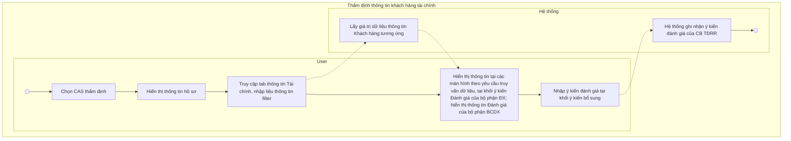

# 13.2.2. Subtab "Thông tin tài chính" - Bộ phận Thẩm định

* <u>I. Tổng quan</u>

    * <u>1. Mục tiêu</u>

    * <u>2. Phạm vi & đối tượng áp dụng</u>

* <u>II. Cấu trúc hiển thị</u>

* <u>III. Luồng xử lý tổng quát & Danh sách chức năng</u>

    * <u>1.Luồng xử lý tổng quát</u>

    * <u>2.Danh sách chức năng</u>

* <u>IV. Chi tiết màn hình, chức năng</u>

    * <u>1.1. Mô tả:</u>

        * <u>4.2. Đồng bộ hiển thị giữa dữ liệu bảng</u>

    * <u>1.2. Màn hình Mockup:</u>

    * <u>1.3. Data các trường thông tin</u>

    * <u>1.4. Flow xử lý chi tiết</u>

<table>
  <thead>
    <tr>
        <th>US</th>
        <th>Subtab Thông tin phi tài chính</th>
    </tr>
  </thead>
  <tbody>
    <tr>
        <td><strong>Squad team</strong></td>
        <td>Squad 2</td>
    </tr>
    <tr>
        <td><strong>Sprint dev</strong></td>
        <td>Sprint 12</td>
    </tr>
    <tr>
        <td><strong>Nghiệp vụ</strong></td>
        <td><u>Nguyễn Châu Giang (giangnc2_TTTĐPD)</u> <u>Uong Thi Hai Yen (yenuth_TTTĐ&amp;PD)</u></td>
    </tr>
    <tr>
        <td><strong>Link Design</strong></td>
        <td><u>https://www.figma.com/design/vByPQcaiQxoeiM5soX84a1/-W--Squad-2--T%E1%BA%A1o-l%E1%BB%93ng-tr%C3%ACnh?node-id=6107-728739&amp;t=Wu5AexYCCo7H7BFM-4</u></td>
    </tr>
    <tr>
        <td><strong>Developer team</strong></td>
        <td>BA: <u>Phan Thanh Chung (chungpt2_TTPTPM) Nguyễn Thị Thu Hằng (hangntt86_TTPTPM)</u> UI/UX: DEV: QC:</td>
    </tr>
  </tbody>
</table>

BẢNG LỊCH SỬ THAY ĐỔI

<table>
  <tr>
    <th>
    </th>
    <th>
      
<b>Ngày</b>

    </th>
    <th>
      
<b>Mô tả</b>

    </th>
    <th>
      
<b>Người thực hiện</b>

    </th>
    <th>
      
<b>Ghi chú</b>

    </th>
  </tr>
</table>

<table>
  <tr>
    <th>
      
1

    </th>
    <th>
      
06/01/2026

    </th>
    <th>
      
Tạo mới

    </th>
    <th>
      
Chungpt2

    </th>
    <th>
      
Tạo mới tài liệu

    </th>
  </tr>
</table>

# I. Tổng quan

## 1. Mục tiêu

<table>
  <tr>
    <th>
      <ul>
        <li><b>Subtab“Thông tin tài chính” thuộc tab “Thông tin khách hàng” cho phép Bộ phận Thẩm định rủi ro thực hiện đánh giá độc lập toàn bộ các nội dung tàichính do Bộ phận Đề xuất (BPĐX) cung cấp, bao gồm:</b></li>
        <ul>
          <li><b>Xác định mức độ đồng thuận đối với phân tích đánh giá của BPĐX</b></li>
          <li><b>Ghi nhận ý kiến bổ sung, điều chỉnh hoặc làm rõ so với nội dung của Bộ phận Đề xuất;</b></li>
        </ul>
        <li><b>Tab này là cơ sở để:</b></li>
        <ul>
          <li><b>Cung cấp cơ sở đầu vào cho kết luận thẩm định rủi ro và cơ chế gợi ý quyết định tín dụng.</b></li>
          <li><b>Đối chiếu giữa nội dung đề xuất và nội dung đánh giá của Bộ phận TĐRR;</b></li>
          <li><b>Phục vụ kiểm soát và phê duyệt Báo cáo thẩm định rủi ro;</b></li>
          <li><b>Cung cấp dữ liệu đầu vào cho cơ chế kiểm tra điều kiện trình hồ sơ.</b></li>
        </ul>
      </ul>
    </th>
  </tr>
</table>

## 2. Phạm vi & đối tượng áp dụng

<table>
  <tr>
    <th>
      <ul>
        <li>Tài liệu này chỉ mô tả các quy tắc nghiệp vụ riêng của Subtab “Thông tin tài chính” tại Bộ phận TĐRR</li>
        <li>Tab này kế thừa và tuân thủ các nguyên tắc chung đã được quy định tại RSD Master – Khối Ý kiến Bộ phận Thẩm định rủi ro: Tổng quan nguyên tắc và logic xử lý hồ sơ của Bộ phận Thẩm định</li>
      </ul>
    </th>
  </tr>
</table>

# II. Cấu trúc hiển thị

* Subtab **“Thông tin tài chính”** được thiết kế theo nguyên tắc phân tách giữa:

    o Ý kiến Bộ phận Đề xuất

    o Ý kiến Bộ phận TĐRR

* Subtab bao gồm các khu vực chức năng:

o Khu vực bộ lọc và thao tác dữ liệu

o Khu vực hiển thị nội dung đánh giá tài chính

* (1) - Khu vực bộ lọc và thao tác dữ liệu

    o Cho phép NSD lựa chọn điều kiện hiển thị dữ liệu tài chính

    o Và thực hiện các chức năng:

        - **Lấy dữ liệu:** tải dữ liệu tài chính theo điều kiện lựa chọn

        - **Báo cáo tài chính:** hiển thị màn hình báo cáo tài chính chi tiết

        - **Chỉ tiêu tài chính:** hiển thị danh sách đầy đủ các chỉ tiêu tài chính

* (2) - Khối Tổng quan tài chính (Các khoản mục, chỉ tiêu tài chính trọng yếu)

    o Hiển thị toàn bộ dữ liệu đánh giá tài chính do Bộ phận Đề xuất cung cấp, bao gồm:

        - Loại KH #TCTD: Bảng cân đối kế toán

        - Loại KH #TCTD: Kết quả hoạt động kinh doanh

        - Loại KH #TCTD: Lưu chuyển tiền tệ

        - Loại KH #TCTD: Bộ chỉ tiêu tài chính

        - Loại KH TCTD: Các nhóm chỉ tiêu tài chính ( An toàn vốn, Cơ cấu tài sản, Chất lượng tài sản, …)

        - Loại KH TCTD: Dữ liệu theo kỳ (năm tài chính)

        - Loại KH TCTD: Biểu đồ minh họa ( nếu có)

    o Chế độ: **read-only**, Không cho phép chỉnh sửa trong mọi trường hợp

* (3) - Khối Ý kiến Bộ phận Đề xuất

    o Hiển thị toàn bộ dữ liệu đánh giá tài chính do Bộ phận Đề xuất cung cấp, bao gồm:

        - Nội dung đánh giá chi tiết theo từng nhóm

        - Đánh giá chung

* Chế độ: **read-only**, Không cho phép chỉnh sửa trong mọi trường hợp

* **(4) - Khối Ý kiến Bộ phận TĐRR**

    * Cho phép lựa chọn trạng thái đánh giá: Đã đánh giá đầy đủ/Bổ sung ý kiến

    * Trường hợp chọn **“Bổ sung ý kiến”**:

        - Hiển thị vùng nhập liệu **Ý kiến bổ sung**

        - Cho phép nhập nội dung bổ sung của Bộ phận TĐRR

# III. Luồng xử lý tổng quát & Danh sách chức năng

## 1.Luồng xử lý tổng quát

## 2.Danh sách chức năng

<table>
  <tr>
    <th>
    </th>
    <th>
      
<b>Use Case</b>

    </th>
    <th>
      
<b>Mô tả</b>

    </th>
  </tr>
  <tr>
    <td>
      
1

    </td>
    <td>
      
Xem nội dung đánh giá tài chính

    </td>
    <td>
      
Cho phép NSD tại các bước của bộ phận TĐRR:

      <ul>
        <li>Xem nội dung đánh giá tài chính do Bộ phận Đề xuất cung cấp (read-only)</li>
        <li>Xem dữ liệu theo từng nhóm chỉ tiêu theo kỳdữ liệu (version BCĐX)</li>
        <li>Dữ liệu hiển thị theo version latest</li>
      </ul>
    </td>
  </tr>
  <tr>
    <td>
      
2

    </td>
    <td>
      
Xem báo cáo tài chính

    </td>
    <td>
      
điều hướng sang màn hìnhBáo cáo tài chínhchi tiết của khách hàngngoài CAS theo kỳ đã chọn trong CAS

    </td>
  </tr>
  <tr>
    <td>
      
3

    </td>
    <td>
      
Xem chỉ tiêu tài chính

    </td>
    <td>
      
điều hướng sang màn hình<b>Chỉ tiêu tài chính</b>ngoài CAS theo kỳ đã chọn trong CAS

    </td>
  </tr>
</table>

<table>
  <tr>
    <th>
      
4

    </th>
    <th>
      
Lấy dữ liệu tài chính

    </th>
    <th>
      
Cho phép NSD thực hiện lấy dữ liệu tài chính theo điều kiện lọc (mẫu báo cáo, kỳ, loại báo cáo)

    </th>
  </tr>
  <tr>
    <td>
      
5

    </td>
    <td>
      
Xem biểu đồ tài chính

      
(chỉ với TCTD)

    </td>
    <td>
      
Cho phép NSD thực hiện xem biểu đồ của từng nhóm chỉ tiêu tài chính tại khối Ý kiến BP đề xuất

    </td>
  </tr>
  <tr>
    <td>
      
6

    </td>
    <td>
      
Nhập và cập nhật ý kiến thẩm định

    </td>
    <td>
      
Cho phép NSD tạibước đầu tiên của bộ phận TĐRR:

      <ul>
        <li>Lựa chọn trạng thái đánh giá (Đã đánh giá đầy đủ/Bổ sung ý kiến)</li>
        <li>Lựa chọn giá trị đánh giá: Bổ sung ý kiến: NSD nhập nội dung ý kiến thẩm địnhtương ứng</li>
      </ul>
    </td>
  </tr>
  <tr>
    <td>
      
7

    </td>
    <td>
      
Lưu subtab thông tin tài chính

    </td>
    <td>
      
Cho phép NSD tạibước đầu tiên của bộ phận TĐRRthực hiện lưu dữ liệu tại khối:

      
Khi thực hiện lưu:

      <ul>
        <li>Hệ thống kiểm tra tính hợp lệ của dữ liệu</li>
        <li>Trường hợp dữ liệuchưa hợp lệ: vẫn cho phép lưu dưới dạngnháp</li>
        <li>Trường hợp dữ liệuhợp lệ: lưu và đánh dấu trạng tháihoàn thành</li>
        <li>Dữ liệu được lưu theo cơ chế version của bộ phận TĐRR, không ghi đè dữ liệu đề xuất.</li>
      </ul>
    </td>
  </tr>
</table>

# IV. Chi tiết màn hình, chức năng

Click here to expand...

## 1.1. Mô tả:

<table>
  <tr>
    <th>
      
🗒️Description

    </th>
    <th>
      
Cho phép cán bộ TĐRR được phân công xử lý hồ sơ, xem toàn bộ thông tin tài chính của khách hàng cùng ý kiến phân tích vủa BPĐX, và đánh giá ý kiến của Bộ phận Đề xuất, bổ sung ý kiến nhằm phục vụ việc thẩm định và ra quyết định tín dụng

    </th>
  </tr>
</table>

Hồ sơ thỏa mãn các điều kiện sau:

* NSD đăng nhập thành công vào hệ thống Lending Hub;
* NSD vào tab “Thông tin khách hàng → Subtab “Thông tin tài chính”;
* Hồ sơ đang ở bước xử lý thuộc Bộ phận Thẩm định rủi ro;

<table>
  <tbody>
    <tr>
        <td>[yes]<strong>Pre-Condition(s)</strong></td>
        <td>Hồ sơ thỏa mãn các điều kiện sau:  • NSD đăng nhập thành công vào hệ thống Lending Hub; • NSD vào tab “Thông tin khách hàng → Subtab “Thông tin tài chính”; • Hồ sơ đang ở bước xử lý thuộc Bộ phận Thẩm định rủi ro; • Hồ sơ đã có dữ liệu thông tin đánh giá tài chính do Bộ phận Đề xuất nhập; • Người dùng có quyền truy cập khối theo tab theo phân quyền đã được cấu hình o Theo link tài liệu <u>4.2.8. Sprint 12 -Nguyên tắc xử lý chung "Ý kiến Bộ phận TĐRR"</u></td>
    </tr>
    <tr>
        <td>[no]<strong>Post-Condition(s)</strong></td>
        <td>Sau khi người dùng lưu dữ liệu tại subtab:  • Dữ liệu đánh giá tài chính của BPTĐRR được lưu vào hệ thống; • Trạng thái đánh giá được cập nhật; • Dữ liệu tại tab sẵn sàng để phục vụ kiểm tra điều kiện trình hồ sơ; • Dữ liệu được sử dụng làm cơ sở để cấp kiểm soát, phê duyệt xem xét, phê duyệt BCTĐRR. • Dữ liệu BCTC hiển thị: Dữ liệu BCTC hiển thị phụ thuộc kỳ do NSD chọn; o Với các kỳ dữ liệu BPĐX đã đưa vào BC: dữ liệu load lại theo version BCĐX o Với các kỳ dữ liệu không có trong version BCĐX, load dữ liệu từ master</td>
    </tr>
  </tbody>
</table>

<table>
  <tr>
    <th>
      Business rule
    </th>
    <th>
      1. Mặc định trạng thái đánh giá và điều kiện hoàn tất:
Tại thời điểm NSD truy cập lần đầu vào subtab:
o Trường “Đánh giá ý kiến BPĐX” được mặc định ở trạng thái chưa chọn (untick)
o Hệ thống cho phép lựa chọn trạng thái đánh giá: Đã đánh giá đầy đủ / Bổ sung ý kiến:
▪ Nếu chọn “Đã đánh giá đầy đủ” → Không cho phép thêm mới nội dung đánh giá
▪ Trường hợp chọn “Bổ sung ý kiến”: Hệ thống hiển thị khối nhập liệu CKEditor; Người dùng bắt buộc nhập nội dung đánh giá bổ sung
o Trường hợp NSD đã chọn “Bổ sung ý kiến” và thực hiện chỉnh sửa dữ liệu, sau đó chuyển lại sang “Đã đánh giá đầy đủ”: Hệ thống ẩn mục nhập liệu thông tin ý kiến bổ sung và không clear dữ liệu của trường này (đã nhập và LƯU trước đó - dữ liệu đã lưu trong CSDLS) để tái sử dụng trong trường hợp NSD thay đổi lại trạng thái đánh giá.
o Tại thời điểm NSD thực hiện Lưu:
Nếu trạng thái của trường “Đánh giá ý kiến BPĐX” chưa được chọn:
▪ Hiển thị thông báo
▪ Focus vào trường chưa được chọn

Nếu trạng thái đánh giá là “bổ sung ý kiến”: hệ thống hiển thị vùng nhập ý kiến bằng CKeditor - yêu cầu bắt buộc nhập. Nếu NSD chưa nhập nội dung hợp lệ vào ô Ý kiến bổ sung:

▪ Hiển thị thông báo
▪ Focus vào trường cần nhập
o Dữ liệu tại subtab được coi là hoàn tất (tick xanh) khi đáp ứng các điều kiện:
▪ NSD đã lựa chọn trạng thái đánh giá “Đã đánh giá đầy đủ / Bổ sung ý kiến”;
▪ Trường hợp có nhóm chọn “Bổ sung ý kiến”: NSD bắt buộc phải nhập nội dung ý kiến bổ sung
2. Cơ chế lấy và hiển thị dữ liệu tài chính
Tại thời điểm NSD truy cập vào subtab, hệ thống tự động tải dữ liệu tài chính do Bộ phận Đề xuất cung cấp
o NSD thực hiện lựa chọn: Mẫu báo cáo, kỳ báo cáo
o Khi NSD nhấn “Lấy dữ liệu”, hệ thống:
▪ Thực hiện truy vấn dữ liệu tài chính theo điều kiện đã chọn
▪ Hiển thị dữ liệu tại các nhóm chỉ tiêu tài chính tương ứng
o Trường hợp không có dữ liệu: Hiển thị trạng thái “Không có dữ liệu”
    </th>
  </tr>
  <tr>
    <td>
      
    </td>
    <td>
      
    </td>
  </tr>
</table>

1. Mặc định trạng thái đánh giá và điều kiện hoàn tất:
Tại thời điểm NSD truy cập lần đầu vào subtab:
* Trường "Đánh giá ý kiến BPĐX" được mặc định ở trạng thái ****chưa chọn (untick)****
* Hệ thống cho phép lựa chọn trạng thái đánh giá: **Đã đánh giá đầy đủ / Bổ sung ý kiến**:
    - Nếu chọn "**Đã đánh giá đầy đủ**" → Không cho phép thêm mới nội dung đánh giá
    - Trường hợp chọn **"Bổ sung ý kiến"**: Hệ thống hiển thị **khối nhập liệu CKEditor; Người dùng bắt buộc nhập nội dung đánh giá bổ sung**
* Trường hợp NSD đã chọn **"Bổ sung ý kiến"** và thực hiện chỉnh sửa dữ liệu, sau đó chuyển lại sang **"Đã đánh giá đầy đủ"**: Hệ thống ẩn mục nhập liệu thông tin ý kiến bổ sung và **không clear dữ liệu** của trường này (đã nhập và LƯU trước đó - dữ liệu đã lưu trong CSDLS) để tái sử dụng trong trường hợp NSD thay đổi lại trạng thái đánh giá.

* Tại thời điểm NSD thực hiện Lưu:
Nếu trạng thái của trường "Đánh giá ý kiến BPĐX" chưa được chọn:

    - Hiển thị thông báo

    - Focus vào trường chưa được chọn

Business rule icon **Business rule**

Nếu trạng thái đánh giá là "bổ sung ý kiến": hệ thống hiển thị vùng nhập ý kiến bằng CKEditor - yêu cầu bắt buộc nhập.
NSD chưa nhập nội dung hợp lý vào ô ý kiến bổ sung:

* Hiển thị thông báo

* Focus vào trường cần nhập

**Dữ liệu tại subtab được coi là hoàn tất (tick xanh) khi đáp ứng các điều kiện:**

* NSD đã lựa chọn trạng thái đánh giá "Đã đánh giá đầy đủ / Bổ sung ý kiến";

* Trường hợp có nhóm chọn "Bổ sung ý kiến": NSD bắt buộc phải nhập nội dung ý kiến bổ sung

2. Cơ chế lấy và hiển thị dữ liệu tài chính

Tại thời điểm NSD truy cập vào subtab, hệ thống **tự động tải dữ liệu tài chính** do Bộ phận Đề xuất cung cấp

* NSD thực hiện lựa chọn: Mẫu báo cáo, kỳ báo cáo

* Khi NSD nhấn "Lấy dữ liệu", hệ thống:

    - Thực hiện truy vấn dữ liệu tài chính theo điều kiện đã chọn
    - Hiển thị dữ liệu tại các nhóm chỉ tiêu tài chính tương ứng
* Trường hợp không có dữ liệu: Hiển thị trạng thái "Không có dữ liệu"

<table>
<tbody>
<tr>
<td>
o Dữ liệu BCTC và chỉ tiêu tài chính tại BP TĐRR hiển thị tương ứng với các kỳ TĐRR chọn tại filter và tuân theo nguyên tắc sau:
- Các kỳ dữ liệu chọn trùng với kỳ BPĐX đã đưa vào BC: load theo version BPĐX
- Các kỳ dữ liệu TĐRR chọn thêm: load theo version master data
o Dữ liệu hiển thị theo:
- Version latest của từng bộ phận
### 3. Cơ chế hiển thị báo cáo và chỉ tiêu tài chính
- Kế thừa tính năng đã phát triển tại squad 1 [CR - Thông tin tài chính trong Đề xuất (CAS)](https://bidv-vn.atlassian.net/wiki/spaces/ps0142025/pages/2331279733/CR+-+Th+ng+tin+t+i+ch+nh+trong+xu+t+CAS)
- Khi NSD nhấn **“Báo cáo tài chính”**:
o Hệ thống điều hướng sang màn hình báo cáo tài chính chi tiết ngoài CAS
o Dữ liệu hiển thị theo CIF và bộ filter (kỳ báo cáo, đơn vị hiển thị) đã chọn trong CAS
- Khi NSD nhấn **“Chỉ tiêu tài chính”**:
o Hệ thống mở màn hình danh sách đầy đủ các chỉ tiêu tài chính ngoài CAS
o Dữ liệu hiển thị phụ thuộc cấu hình danh mục chỉ tiêu theo CIF và bộ filter (kỳ báo cáo, đơn vị hiển thị) đã chọn trong CAS
### 4. Chuyển đổi hiển thị số liệu
4.1. Hệ thống phải hỗ trợ người dùng lựa chọn đơn vị hiển thị số liệu, tối thiểu gồm:
- Nghìn;
- Triệu;
- Tỷ
Khi người dùng thay đổi đơn vị hiển thị, toàn bộ số liệu tại tab và các màn hình xem nhanh liên quan phải được cập nhật đồng nhất theo đơn vị đã chọn.
### 4.2. Đồng bộ hiển thị giữa dữ liệu bảng
Khi người dùng thay đổi:
- đơn vị hiển thị;
- kỳ dữ liệu;
hệ thống phải đồng bộ cách hiển thị giữa:
</td>
</tr>
</tbody>
</table>

o Dữ liệu BCTC và chỉ tiêu tài chính tại BP TĐRR hiển thị tương ứng với các kỳ TĐRR chọn tại filter và tuân theo nguyên tắc sau:

- Các kỳ dữ liệu chọn trùng với kỳ BPĐX đã đưa vào BC: load theo version BPĐX
- Các kỳ dữ liệu TĐRR chọn thêm: load theo version master data

o Dữ liệu hiển thị theo:

- Version latest của từng bộ phận

o Dữ liệu hiển thị theo CIF và bộ filter (kỳ báo cáo, đơn vị hiển thị) đã chọn trong CAS

o Hệ thống mở màn hình danh sách đầy đủ các chỉ tiêu tài chính ngoài CAS

o Dữ liệu hiển thị phụ thuộc cấu hình danh mục chỉ tiêu theo CIF và bộ filter (kỳ báo cáo, đơn vị hiển thị) đã chọn trong CAS

4.1. Hệ thống phải hỗ trợ người dùng lựa chọn đơn vị hiển thị số liệu, tối thiểu gồm:

- Nghìn;

Khi người dùng thay đổi đơn vị hiển thị, toàn bộ số liệu tại tab và các màn hình xem nhanh liên quan phải được cập nhật đồng nhất theo đơn vị đã chọn.

### 4.2. Đồng bộ hiển thị giữa dữ liệu bảng

Khi người dùng thay đổi:

- đơn vị hiển thị;

- kỳ dữ liệu;

hệ thống phải đồng bộ cách hiển thị giữa:

<table>
  <tbody>
    <tr>
        <td> </td>
        <td>o Dữ liệu BCTC và chỉ tiêu tài chính tại BP TĐRR hiển thị tương ứng với các kỳ TĐRR chọn tại filter và tuân theo nguyên tắc sau: ▪ Các kỳ dữ liệu chọn trùng với kỳ BPĐX đã đưa vào BC: load theo version BPĐX ▪ Các kỳ dữ liệu TĐRR chọn thêm: load theo version master data o Dữ liệu hiển thị theo: ▪ Version latest của từng bộ phận <strong>3. Cơ chế hiển thị báo cáo và chỉ tiêu tài chính</strong>  • Kế thừa tính năng đã phát triển tại squad 1 [CR - Thông tin tài chính trong Đề xuất (CAS)](https://example.com) • Khi NSD nhấn <strong>“Báo cáo tài chính”</strong>: o Hệ thống điều hướng sang màn hình báo cáo tài chính chi tiết ngoài CAS o Dữ liệu hiển thị theo CIF và bộ filter (kỳ báo cáo, đơn vị hiển thị) đã chọn trong CAS • Khi NSD nhấn <strong>“Chỉ tiêu tài chính”</strong>: o Hệ thống mở màn hình danh sách đầy đủ các chỉ tiêu tài chính ngoài CAS o Dữ liệu hiển thị phụ thuộc cấu hình danh mục chỉ tiêu theo CIF và bộ filter (kỳ báo cáo, đơn vị hiển thị) đã chọn trong CAS  <strong>4. Chuyển đổi hiển thị số liệu</strong>  4.1. Hệ thống phải hỗ trợ người dùng lựa chọn đơn vị hiển thị số liệu, tối thiểu gồm:  • Nghìn; • Triệu; • Tỷ  Khi người dùng thay đổi đơn vị hiển thị, toàn bộ số liệu tại tab và các màn hình xem nhanh liên quan phải được cập nhật đồng nhất theo đơn vị đã chọn.  <strong>4.2. Đồng bộ hiển thị giữa dữ liệu bảng</strong>  Khi người dùng thay đổi:  • đơn vị hiển thị; • kỳ dữ liệu;  hệ thống phải đồng bộ cách hiển thị giữa:</td>
    </tr>
  </tbody>
</table>

<table>
  <thead>
    <tr>
        <th>Tính năng</th>
        <th>Màn hình moockup</th>
    </tr>
  </thead>
</table>

# 1.2. Màn hình Mockup:

Link Figma: <u>https://www.figma.com/design/vByPQcaiQxoeiM5soX84a1/-W--Squad-2--T%E1%BA%A1o-lu%E1%BB%93ng-tr%C3%ACnh?node-id=6440-401693&t=LBRsIV72OEG4J5e4-4</u>

<table>
  <thead>
    <tr>
        <th>Tính năng</th>
        <th>Màn hình moockup</th>
    </tr>
  </thead>
</table>

BIDV logo
Lưu Mai Thu Thảo
Chuyên viên

**Màn hình khi mở tab**

Lending > Công việc chờ tôi xử lý > Hồ sơ trình cấp tín dụng

# < Hồ sơ trình cấp tín dụng
[Trình duyệt] [Trả lại]

**Số HS: 2193915** Loại hồ sơ: Cấp mới [Chờ xử lý] Bước xử lý: Lập BCTĐRR Người xử lý: Lưu Mai Thu Thảo - 543210
Tổng công ty Điện lực Việt Nam - CIF 128355 XHTDNB: A Hồ sơ tham chiếu: TD-128-24-123456 Phiên bản: 3.0

* **Thông tin khách hàng**
    - Thông tin phi tài chính
    - Thông tin tài chính
    - Quan hệ TCTD
    - Hồ sơ khách hàng
    - Khoản cấp tín dụng

200/2014/TT-BTC [dropdown] Riêng lẻ [dropdown] Đã chọn 4 giá trị [dropdown] [Lấy dữ liệu]

## Đánh giá tài chính [Báo cáo tài chính] [Chỉ tiêu tài chính] [Lưu]
Đơn vị tính: VND [dropdown] Đơn vị hiển thị: Tỷ [dropdown]

### Tổng quan tài chính
Bảng cân đối kế toán [dropdown]
Kết quả hoạt động kinh doanh [dropdown]
Lưu chuyển tiền tệ [dropdown]
Chỉ tiêu tài chính [dropdown]

### Ý kiến bộ phận đề xuất

### Ý kiến bộ phận thẩm định
Đánh giá ý kiến BP đề xuất
( ) Đã đánh giá đầy đủ ( ) Bổ sung ý kiến

*Khi mở tab khối Ý kiến bộ phận đề xuất mặc định collapse*

<table>
  <tbody>
    <tr>
        <td><strong>Màn hình khi mở tab</strong></td>
        <td> <em>Khi mở tab khối Ý kiến bộ phận đề xuất mặc định collapse</em></td>
    </tr>
  </tbody>
</table>

Screenshot of a web application interface showing a document review or assessment page with multiple sections and text blocks.

<table>
  <tbody>
    <tr>
        <td> </td>
        <td rowspan="2"> </td>
    </tr>
    <tr>
        <td><strong>Màn hình khi</strong> <strong>expand khối</strong> <strong>Ý kiến bộ</strong> <strong>phận đề xuất</strong></td>
    </tr>
  </tbody>
</table>

Screenshot of a banking application interface showing a detailed report or dashboard with tables and text sections.

<table>
  <thead>
    <tr>
        <th>Chỉ tiêu</th>
        <th>31/12/2022</th>
        <th>31/12/2021</th>
        <th>31/12/2020</th>
    </tr>
  </thead>
  <tbody>
    <tr>
        <td>Lợi nhuận thuần từ hoạt động kinh doanh</td>
        <td>21.737</td>
        <td>17.541</td>
        <td>16.030</td>
    </tr>
    <tr>
        <td>Lợi nhuận thuần từ hoạt động dịch vụ</td>
        <td>6.265</td>
        <td>6.614</td>
        <td>5.276</td>
    </tr>
    <tr>
        <td>Lợi nhuận thuần từ hoạt động khác</td>
        <td>4.120</td>
        <td>2.132</td>
        <td>3.462</td>
    </tr>
    <tr>
        <td>Lợi nhuận thuần từ hoạt động kinh doanh</td>
        <td>31.160</td>
        <td>25.543</td>
        <td>23.344</td>
    </tr>
  </tbody>
</table>

BIDV logo

<table>
  <thead>
    <tr>
        <th colspan="2">Vốn hoạt động</th>
        <th>2020 - Kiểm toán</th>
        <th>2021 - Kiểm toán</th>
        <th>2022 - Kiểm toán</th>
        <th>Đơn vị: VNĐ 30/06/2023 - Soát xét</th>
    </tr>
    <tr>
        <th>STT</th>
        <th>Chỉ tiêu</th>
        <th>Giá trị</th>
        <th>Giá trị</th>
        <th>Giá trị</th>
        <th>Giá trị</th>
    </tr>
  </thead>
  <tbody>
    <tr>
        <td>1</td>
        <td>Tổng tài sản</td>
        <td>439.602.541.000.000</td>
        <td>568.811.111.000.000</td>
        <td>699.032.541.000.000</td>
        <td>708.255.111.000.000</td>
    </tr>
    <tr>
        <td>2</td>
        <td>Vốn chủ sở hữu</td>
        <td>74.852.111.000.000</td>
        <td>93.082.111.000.000</td>
        <td>113.424.111.000.000</td>
        <td>125.458.111.000.000</td>
    </tr>
    <tr>
        <td>3</td>
        <td>Vốn điều lệ</td>
        <td>35.049.111.000.000</td>
        <td>35.109.111.000.000</td>
        <td>35.172.111.000.000</td>
        <td>35.172.111.000.000</td>
    </tr>
    <tr>
        <td colspan="6">Nhận xét:</td>
    </tr>
  </tbody>
</table>

# 1. Hồ sơ trình cấp tín dụng

**Ngân hàng TMCP Techcombank - CIF: 1234567** <mark>Đang xử lý</mark> <mark>Đang trình</mark>
Số tờ trình: 01/2023/TT-TCTD | Ngày trình: 15/05/2023 | Đơn vị trình: Phòng Khách hàng Doanh nghiệp 1 - Chi nhánh Hà Thành | Cán bộ đề xuất: Nguyễn Văn Thắng

*   Thông tin khách hàng
*   Thông tin đề xuất
*   Đánh giá tài chính
*   Đánh giá phi tài chính
*   Đánh giá chung
*   Kết luận và kiến nghị

## Đánh giá tài chính
[ ] Xem báo cáo tài chính [ ] Xem phân tích tài chính [Lưu]

### [x] Phân tích bảng cân đối

**Vốn hoạt động** (ĐVT: Triệu VNĐ)
<table>
  <thead>
    <tr>
        <th>STT</th>
        <th>Chỉ tiêu</th>
        <th>2020 - Thuế</th>
        <th>2021 - Thuế</th>
        <th>2022 - Kiểm toán</th>
        <th>Quý 1/2023 - Nội bộ</th>
    </tr>
  </thead>
  <tbody>
    <tr>
        <td>1</td>
        <td>Tổng tài sản</td>
        <td>100.000.000</td>
        <td>120.000.000</td>
        <td>150.000.000</td>
        <td>160.000.000</td>
    </tr>
    <tr>
        <td>2</td>
        <td>Vốn chủ sở hữu</td>
        <td>30.000.000</td>
        <td>40.000.000</td>
        <td>50.000.000</td>
        <td>55.000.000</td>
    </tr>
    <tr>
        <td>3</td>
        <td>Nợ phải trả</td>
        <td>70.000.000</td>
        <td>80.000.000</td>
        <td>100.000.000</td>
        <td>105.000.000</td>
    </tr>
  </tbody>
</table>

**Nhận xét:**
Khách hàng có quy mô vốn tăng trưởng tốt qua các năm.

**Chất lượng tài sản - Các khoản nợ phải thu** (ĐVT: Triệu VNĐ)
<table>
  <thead>
    <tr>
        <th>STT</th>
        <th>Chỉ tiêu</th>
        <th>2020 - Thuế</th>
        <th>2021 - Thuế</th>
        <th>2022 - Kiểm toán</th>
        <th>Quý 1/2023 - Nội bộ</th>
    </tr>
  </thead>
  <tbody>
    <tr>
        <td>1</td>
        <td>Phải thu khách hàng ngắn hạn</td>
        <td>20.000.000</td>
        <td>25.000.000</td>
        <td>30.000.000</td>
        <td>35.000.000</td>
    </tr>
    <tr>
        <td>2</td>
        <td>Phải thu khách hàng dài hạn</td>
        <td>5.000.000</td>
        <td>7.000.000</td>
        <td>10.000.000</td>
        <td>12.000.000</td>
    </tr>
    <tr>
        <td>3</td>
        <td>Dự phòng phải thu khó đòi</td>
        <td>(500.000)</td>
        <td>(700.000)</td>
        <td>(1.000.000)</td>
        <td>(1.200.000)</td>
    </tr>
  </tbody>
</table>

**Nhận xét:**
Các khoản phải thu tăng tương ứng với quy mô doanh thu.

**Chất lượng tài sản - Cho vay khách hàng** (ĐVT: Triệu VNĐ)
<table>
  <thead>
    <tr>
        <th>STT</th>
        <th>Chỉ tiêu</th>
        <th>2020 - Thuế</th>
        <th>2021 - Thuế</th>
        <th>2022 - Kiểm toán</th>
        <th>Quý 1/2023 - Nội bộ</th>
    </tr>
  </thead>
  <tbody>
    <tr>
        <td>1</td>
        <td>Cho vay KH</td>
        <td>50.000.000</td>
        <td>60.000.000</td>
        <td>80.000.000</td>
        <td>85.000.000</td>
    </tr>
    <tr>
        <td>2</td>
        <td>Dự phòng rủi ro</td>
        <td>(1.000.000)</td>
        <td>(1.200.000)</td>
        <td>(1.500.000)</td>
        <td>(1.600.000)</td>
    </tr>
  </tbody>
</table>

**Nhận xét:**
Hoạt động tín dụng tăng trưởng ổn định.

### Đánh giá chung
Khách hàng có tình hình tài chính lành mạnh, các chỉ số an toàn vốn đảm bảo quy định.

### [x] Phân tích phi tài chính
**Đánh giá phi tài chính đề xuất**
[ ] Đã hoàn thành đánh giá [x] Đang trong quá trình

BIDV logo [Search] [VN] [EN] [Notifications] **Lê Thị Thu Thảo**

* [Home]
* [Dashboard]
* [Reports]
* [Analytics]
* [Settings]
* [Help]

Trang chủ / Báo cáo quản trị / Báo cáo tổng hợp kết quả kinh doanh

# Báo cáo tổng hợp kết quả kinh doanh - Chi nhánh     

[Xuất báo cáo] [Lưu báo cáo]

* Thông tin chung
* **Kết quả kinh doanh**
* Chi phí
* Nhân sự
* Khác

## Kết quả kinh doanh

### Bảng kết quả kinh doanh

<table>
  <thead>
    <tr>
        <th>STT</th>
        <th>Chỉ tiêu</th>
        <th>Thực hiện</th>
        <th>Kế hoạch</th>
        <th>Tỷ lệ thực hiện (%)</th>
        <th>Cùng kỳ năm trước</th>
    </tr>
  </thead>
  <tbody>
    <tr>
        <td>1</td>
        <td>Tổng thu nhập</td>
        <td>    </td>
        <td>    </td>
        <td>    </td>
        <td>    </td>
    </tr>
    <tr>
        <td>2</td>
        <td>Tổng chi phí</td>
        <td>    </td>
        <td>    </td>
        <td>    </td>
        <td>    </td>
    </tr>
    <tr>
        <td>3</td>
        <td>Lợi nhuận trước thuế</td>
        <td>    </td>
        <td>    </td>
        <td>    </td>
        <td>    </td>
    </tr>
  </tbody>
</table>

### Biểu đồ kết quả kinh doanh

<table>
  <thead>
    <tr>
        <th>Giai đoạn</th>
        <th>Thu nhập lãi thuần</th>
        <th>Thu nhập ngoài lãi</th>
        <th>Chi phí hoạt động</th>
        <th>Chi phí dự phòng rủi ro</th>
    </tr>
  </thead>
  <tbody>
    <tr>
        <td>2019</td>
        <td>    </td>
        <td>    </td>
        <td>    </td>
        <td>    </td>
    </tr>
    <tr>
        <td>2020</td>
        <td>    </td>
        <td>    </td>
        <td>    </td>
        <td>    </td>
    </tr>
    <tr>
        <td>2021</td>
        <td>    </td>
        <td>    </td>
        <td>    </td>
        <td>    </td>
    </tr>
    <tr>
        <td>2022</td>
        <td>    </td>
        <td>    </td>
        <td>    </td>
        <td>    </td>
    </tr>
  </tbody>
</table>

## Chi phí hoạt động

<table>
  <thead>
    <tr>
        <th>STT</th>
        <th>Chỉ tiêu</th>
        <th>Thực hiện</th>
        <th>Kế hoạch</th>
        <th>Tỷ lệ thực hiện (%)</th>
        <th>Cùng kỳ năm trước</th>
    </tr>
  </thead>
  <tbody>
    <tr>
        <td colspan="2">Tổng cộng</td>
        <td>2.001.111</td>
        <td>2.001.111</td>
        <td>100</td>
        <td>2.001.111</td>
    </tr>
    <tr>
        <td>1</td>
        <td>Chi lương và phụ cấp</td>
        <td>1.000.000</td>
        <td>1.000.000</td>
        <td>100</td>
        <td>1.000.000</td>
    </tr>
    <tr>
        <td>2</td>
        <td>Chi quản lý công vụ</td>
        <td>1.001.111</td>
        <td>1.001.111</td>
        <td>100</td>
        <td>1.001.111</td>
    </tr>
    <tr>
        <td>3</td>
        <td>Chi khác</td>
        <td> </td>
        <td> </td>
        <td> </td>
        <td> </td>
    </tr>
  </tbody>
</table>

## Chỉ tiêu khác

<table>
  <thead>
    <tr>
        <th>STT</th>
        <th>Chỉ tiêu</th>
        <th>Thực hiện</th>
        <th>Kế hoạch</th>
        <th>Tỷ lệ thực hiện (%)</th>
        <th>Cùng kỳ năm trước</th>
    </tr>
  </thead>
  <tbody>
    <tr>
        <td>1</td>
        <td>Huy động vốn</td>
        <td>    </td>
        <td>    </td>
        <td>    </td>
        <td>    </td>
    </tr>
    <tr>
        <td>2</td>
        <td>Dư nợ tín dụng</td>
        <td>    </td>
        <td>    </td>
        <td>    </td>
        <td>    </td>
    </tr>
  </tbody>
</table>

<table>
  <thead>
    <tr>
        <th>Chỉ tiêu</th>
        <th>Trọng số</th>
        <th>Điểm tối đa</th>
        <th>Điểm tự đánh giá</th>
        <th>Điểm TĐRR</th>
        <th>Ghi chú</th>
    </tr>
  </thead>
  <tbody>
    <tr>
        <td colspan="6"><strong>1. Đánh giá định lượng</strong></td>
    </tr>
    <tr>
        <td>1.1. Chỉ tiêu tài chính</td>
        <td>10%</td>
        <td>10</td>
        <td>10</td>
        <td>10</td>
        <td> </td>
    </tr>
    <tr>
        <td>1.2. Chỉ tiêu phi tài chính</td>
        <td>10%</td>
        <td>10</td>
        <td>10</td>
        <td>10</td>
        <td> </td>
    </tr>
    <tr>
        <td>1.3. Chỉ tiêu tuân thủ</td>
        <td>10%</td>
        <td>10</td>
        <td>10</td>
        <td>10</td>
        <td> </td>
    </tr>
    <tr>
        <td>1.4. Chỉ tiêu khác</td>
        <td>10%</td>
        <td>10</td>
        <td>10</td>
        <td>10</td>
        <td> </td>
    </tr>
    <tr>
        <td colspan="6"><strong>2. Đánh giá định tính</strong></td>
    </tr>
    <tr>
        <td>2.1. Đánh giá rủi ro</td>
        <td>20%</td>
        <td>20</td>
        <td>20</td>
        <td>20</td>
        <td> </td>
    </tr>
    <tr>
        <td>2.2. Đánh giá kiểm soát</td>
        <td>20%</td>
        <td>20</td>
        <td>20</td>
        <td>20</td>
        <td> </td>
    </tr>
    <tr>
        <td>2.3. Đánh giá khác</td>
        <td>20%</td>
        <td>20</td>
        <td>20</td>
        <td>20</td>
        <td> </td>
    </tr>
    <tr>
        <td><strong>Tổng cộng</strong></td>
        <td><strong>100%</strong></td>
        <td><strong>100</strong></td>
        <td><strong>100</strong></td>
        <td><strong>100</strong></td>
        <td> </td>
    </tr>
  </tbody>
</table>

Screenshot of a web application interface showing a data table and several text sections. The interface has a sidebar on the left and a main content area with a header, a table titled "Kết quả đánh giá", and several expandable sections below it.

CB TDRR
chọn "Đã đánh giá đầy đủ" - không hiện khối editor

<table>
  <tr>
    <th>
      
3

    </th>
    <th colspan="7">
      
Cụm “Ý kiến Bộ phận TĐRR”

      <ul>
        <li>Yêu cầu hiển thị: tách biệt và nổi bật tiêu đề khối để dễ nhận biết và phân biệt với các đánh giá của BP đề xuất</li>
        <li>Bao gồm các thông tin dưới đây</li>
      </ul>
    </th>
  </tr>
  <tr>
    <td>
      
4

    </td>
    <td>
      
Đánh giá ý kiến BP đề xuất

    </td>
    <td>
      
Radio button

    </td>
    <td>
      
Chọn

    </td>
    <td>
      
M

    </td>
    <td>
      
-

    </td>
    <td>
      
Untick

    </td>
    <td>
      <ul>
        <li>Cho phép NSD chọn ý kiến của bộ phận TĐRR</li>
        <li>Bao gồm các giá trị:</li>
        <ul>
          <li>Đã đánh giá đầy đủ</li>
          <li>Bổ sung ý kiến</li>
        </ul>
      </ul>
    </td>
  </tr>
  <tr>
    <td>
      
5

    </td>
    <td>
      
Ý kiến bổ sung

    </td>
    <td>
      
Text editor

    </td>
    <td>
      
Nhập

    </td>
    <td>
      
MO

    </td>
    <td>
      
2000

    </td>
    <td>
      
-

    </td>
    <td>
      <ul>
        <li>Chỉ hiển thị nếu Trạng thái đánh giá của TĐRR là = Bổ sung ý kiến</li>
        <li>Cho phép NSD thực hiện nhập liệu ý kiến đánh giá bổ sung của TĐRR.</li>
        <li>Hệ thống hỗ trợ nhập text, kẻ bảng, chèn ảnh tại trường thông tin này</li>
      </ul>
    </td>
  </tr>
</table>

# 1.3. Data các trường thông tin

* Tương tự tab Thông tin khách hàng - Đánh giá tài chính của Bộ phận Đề xuất: https://bidv-vn.atlassian.net/wiki/x/dYH0ig

* Dưới đây chỉ mô tả bổ sung thông tin đánh giá của Bộ phận TĐRR

<table>
  <thead>
    <tr>
        <th> </th>
        <th>Hạng mục</th>
        <th>Định dạng</th>
        <th>Kiểu thao tác</th>
        <th>Bắt buộc (M/O)</th>
        <th>Độ dài</th>
        <th>Giá trị mặc định</th>
        <th>Mô tả/Validate</th>
    </tr>
  </thead>
  <tbody>
    <tr>
        <td colspan="8">1</td>
    </tr>
    <tr>
        <td>2</td>
        <td><strong>Cụm “Ý kiến Bộ phận Đề xuất”</strong></td>
        <td>Text</td>
        <td>Hiển thị</td>
        <td>-</td>
        <td>-</td>
        <td>-</td>
        <td>Kế thừa từ squad 1 bao gồm các trường thông tin mô tả tại tài liệu https://bidv-vn.atlassian.net/wiki/x/dYH0ig</td>
    </tr>
    <tr>
        <td>3</td>
        <td colspan="7"><strong>Cụm “Ý kiến Bộ phận TĐRR”</strong> \* Yêu cầu hiển thị: tách biệt và nổi bật tiêu đề khối để dễ nhận biết và phân biệt với các đánh giá của BP đề xuất \* Bao gồm các thông tin dưới đây</td>
    </tr>
    <tr>
        <td>4</td>
        <td>Đánh giá ý kiến BP đề xuất</td>
        <td>Radio button</td>
        <td>Chọn</td>
        <td>M</td>
        <td>-</td>
        <td>Untick</td>
        <td>\* Cho phép NSD chọn ý kiến của bộ phận TĐRR \* Bao gồm các giá trị: o Đã đánh giá đầy đủ o Bổ sung ý kiến</td>
    </tr>
    <tr>
        <td>5</td>
        <td>Ý kiến bổ sung</td>
        <td>Text editor</td>
        <td>Nhập</td>
        <td>MO</td>
        <td>2000</td>
        <td>-</td>
        <td>\* Chỉ hiển thị nếu Trạng thái đánh giá của TĐRR là = Bổ sung ý kiến \* Cho phép NSD thực hiện nhập liệu ý kiến đánh giá bổ sung của TĐRR. \* Hệ thống hỗ trợ nhập text, kẻ bảng, chèn ảnh tại trường thông tin này</td>
    </tr>
  </tbody>
</table>

# 1.4. Flow xử lý chi tiết

<table>
  <thead>
    <tr>
        <th>Tính năng/Step</th>
        <th>Action</th>
        <th>Actor</th>
        <th>Mô tả chi tiết xử lý</th>
    </tr>
  </thead>
  <tbody>
    <tr>
        <td colspan="4"><strong>Kích hoạt màn hình</strong></td>
    </tr>
  </tbody>
</table>

<table>
  <tbody>
    <tr>
        <td><strong>Step 1</strong></td>
        <td>* NSD đăng nhập thành công vào hệ thống Lending - hub và được gán xử lý bước hiện tại của hồ sơ chức năng * NSD truy cập menu Thông tin Tài chính</td>
        <td>NSD TĐRR</td>
        <td>* NSD truy cập menu Thông tin tài chính * Hệ thống xác định quyền thao tác của NSD theo nguyên tắc chung mô tả tại <strong>Pre-Condition(s)</strong> * Hệ thống hiển thị UI với khối và trường thông tin mô tả tại mục 1.3 bên trên <strong>tùy thuộc vào NSD thao tác và bước hiện tại của hồ sơ</strong> theo nguyên tắc     o Nguyên tắc phân quyền tại link <u>4.2.8. Sprint 12 -Nguyên tắc xử lý chung "Ý kiến Bộ phận TĐRR"</u>     o Nguyên tắc kế thừa dữ liệu tại link: <u>4.2.8. Sprint 12 -Nguyên tắc xử lý chung "Ý kiến Bộ phận TĐRR"</u>     o Nguyên tắc kiểm soát chỉnh sửa tại link: <u>4.2.8. Sprint 12 -Nguyên tắc xử lý chung "Ý kiến Bộ phận TĐRR"</u></td>
    </tr>
    <tr>
        <td colspan="4"><strong>NSD nhập thông tin và nhấn button “Lưu” tại menu “Thông tin tài chính”</strong></td>
    </tr>
  </tbody>
</table>

<table>
  <thead>
    <tr>
      <th>Step2</th>
      <th>NSD thuộc bước đầu tiên 
của bộ phận TĐRR nhập 
liệu các thông tin trên và 
click vào button “Lưu” tại tab
“Thông tin tài chính”</th>
      <th>NSD 
TĐRR</th>
      <th>Hệ thống thực hiện:
o Validate dữ liệu bắt buộc theo 
quy định tại mục 1.3 bên trên
o Cơ chế lưu tại khối này tuân 
thủ nguyên tắc chung:
Cơ chế xử lý khi Lưu: 
<u>4.2.8. Sprint 12 </u>
<u>-Nguyên tắc xử lý </u>
<u>chung "Ý kiến Bộ phận</u>
<u>TĐRR"</u>
Quy tắc quản lý và sinh
version: 4.2.8. Sprint 
<u>12 -Nguyên tắc xử lý </u>
<u>chung "Ý kiến Bộ phận</u>
<u>TĐRR"</u>
Trường hợp dữ liệu đầy đủ & hợp 
lệ, hệ thống:
o Ghi nhận log: người thực hiện,
thời gian thực hiện, version.
o Hiển thị toast: “Lưu thành 
công”
o Tab hiển thị tick xanh (đã lưu)
o Màn hình chuyển về trạng thái 
view.</th>
    </tr>
  </thead>
  <tbody>
    <tr>
      <td>Step3</td>
      <td>NSD thuộc bước đầu tiên 
của bộ phận TĐRR không 
click vào button “Lưu” mà 
thực hiện chuyển sang tab 
khác</td>
      <td>NSD 
TĐRR</td>
      <td>Hệ thống kiểm soát theo nguyên tắc 
chuyển tab mô tả tại link 4.2.8. Sprint 
<u>12 -Nguyên tắc xử lý chung "Ý kiến </u>
<u>Bộ phận TĐRR"</u></td>
    </tr>
    <tr>
      <td colspan="4">NSD trình duyệt chuyển bước hồ sơ</td>
    </tr>
    <tr>
      <td>Step4</td>
      <td>NSD hoàn tất các tab của hồ 
sơ và thực hiện thao tác 
“Trình duyệt”
 
“Điều kiện hiển thị button 
“Trình duyệt” tuân thủ 
nguyên tắc tất cả các tab có 
trạng thái tick xanh”</td>
      <td>NSD 
TĐRR</td>
      <td>Khi hồ sơ được chuyển sang bước tiếp theo 
thông tin đánh giá TĐRR được hiển thị ở chế 
độ read-only đối với người dùng vừa thực 
hiện thao tác chuyển bước.</td>
    </tr>
    <tr>
      <td colspan="4">NSD thuộc Bộ phận TĐRR trả lại hồ sơ</td>
    </tr>
  </tbody>
</table>

<table>
  <tbody>
    <tr>
        <td><strong>Step5</strong></td>
        <td>NSD thuộc bộ phận TĐRR thực hiện trả lại hồ sơ</td>
        <td>NSD TĐRR</td>
        <td>* NSD tại một trong các bước thuộc bộ phận TĐRR thực hiện thao tác trả hồ sơ theo các loại: o Trả nội bộ trong Bộ phận TĐRR o Trả về Bộ phận Đề xuất * Hệ thống xử lý dữ liệu theo <strong>nguyên tắc của khối dữ liệu đánh giá</strong> o Cụ thể mô tả tại tài liệu <u>4.2.8. Sprint 12 -Nguyên tắc xử lý chung "Ý kiến Bộ phận TĐRR"</u></td>
    </tr>
    <tr>
        <td colspan="4"><strong>Trường hợp các bước khác trình lại/cấp thẩm quyền trả lại hồ sơ về TĐRR</strong></td>
    </tr>
    <tr>
        <td><strong>Step6</strong></td>
        <td>Hồ sơ được trình lại/trả lại về Bộ phận TĐRR</td>
        <td>Hệ thống</td>
        <td>Hệ thống xử lý theo nguyên tắc xử lý khi tiếp nhận hồ sơ mô tả tại <u>4.2.8. Sprint 12 -Nguyên tắc xử lý chung "Ý kiến Bộ phận TĐRR"</u></td>
    </tr>
  </tbody>
</table>

*Phần nội dung liên quan Gợi ý nhận xét AI - tính năng xem xét xử lý xây dựng tại GD 2: refer

Phu luc_Tinh nan...nhan xet AI.docx file icon

Phu luc_Tinh nan...nhan xet AI.docx

tài liệu tham khảo: