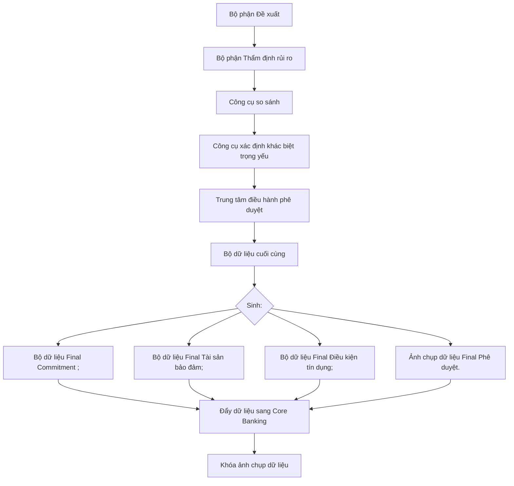

# 15.2. Tab "Phê duyệt cấp tín dụng"

* <u>I. TỔNG QUAN</u>

    * <u>1. Mục tiêu</u>

    * <u>2. Phạm vi</u>

    * <u>3. Đối tượng sử dụng</u>

    * <u>4.Ma trận vai trò tham gia xử lý hồ sơ</u>

* <u>II. KIẾN TRÚC NGHIỆP VỤ PHÊ DUYỆT CẤP TÍN DỤNG</u>

* <u>III. NGUYÊN TẮC DỮ LIỆU QUYẾT ĐỊNH CUỐI CÙNG</u>

    * <u>1. Final Dataset Principle</u>

    * <u>2. Không ghi đè dữ liệu nguồn</u>

* <u>IV. NGUYÊN TẮC XỬ LÝ KHÁC BIỆT</u>

    * <u>1. Công cụ xử lý khác biệt trọng yếu</u>

    * <u>2. Nguyên tắc lựa chọn phương án xử lý</u>

* <u>V. NGUYÊN TẮC XỬ LÝ DỮ LIỆU</u>

    * <u>1. Load dữ liệu</u>

    * <u>2. So sánh dữ liệu</u>

    * <u>3. Sinh bộ dữ liệu phê duyệt</u>

* <u>VI. NGUYÊN TẮC SNAPSHOT & ĐÓNG BĂNG DỮ LIỆU</u>

    * <u>1. Approval Snapshot</u>

    * <u>2. Đóng băng dữ liệu</u>

    * <u>3. Audit Trail</u>

* <u>VII. NGUYÊN TẮC PHÂN QUYỀN</u>

    * <u>1. Phân quyền xử lý</u>

    * <u>2. Phân quyền theo workflow</u>

    * <u>3.Phân quyền theo tab/subtab</u>

    * <u>4.Ma trận phân quyền theo bước xử lý, tab và khối dữ liệu</u>

* <u>VIII. NGUYÊN TẮC PHI CHỨC NĂNG</u>

    * <u>1. Hiệu năng</u>

    * <u>2. Bảo mật</u>

    * <u>3. Truy vết</u>

    * <u>4. Khả năng mở rộng</u>

* <u>IX. NGUYÊN TẮC CHUNG KHÁC</u>

    * <u>1. Nguyên tắc kiểm soát chỉnh sửa dữ liệu trong bộ phận</u>

    * <u>2.Quy tắc quản lý và sinh version</u>

    * <u>3.Nguyên tắc xử lý khi trả lại hồ sơ</u>

    * <u>4.Cơ chế xử lý khi Lưu</u>

* <u>X. KIẾN TRÚC XỬ LÝ TỔNG THỂ</u>

<table>
  <tr>
    <th>
      
US

    </th>
    <th>
      
Nguyên tắc xử lý "Luồng xin ý kiến Thành viên Hội đồng"

    </th>
  </tr>
  <tr>
    <td>
      
Squad team

    </td>
    <td>
      
Squad 2

    </td>
  </tr>
  <tr>
    <td>
      
Sprint dev

    </td>
    <td>
      
Sprint 15

    </td>
  </tr>
</table>

<table>
  <tr>
    <th>
      
Nghiệp vụ

    </th>
    <th>
    </th>
  </tr>
  <tr>
    <td>
      
Link Design

    </td>
    <td>
    </td>
  </tr>
  <tr>
    <td>
      
Developer team

    </td>
    <td>
      
BA:

      
UI/UX:

      
DEV:

      
QC:

    </td>
  </tr>
</table>

**BẢNG LỊCH SỬ THAY ĐỔI**

<table>
  <tr>
    <th>
    </th>
    <th>
      
<b>Ngày</b>

    </th>
    <th>
      
<b>Mô tả</b>

    </th>
    <th>
      
<b>Người thực hiện</b>

    </th>
    <th>
      
<b>Ghi chú</b>

    </th>
  </tr>
  <tr>
    <td>
      
1

    </td>
    <td>
      
25/05/2026

    </td>
    <td>
      
Tạo mới

    </td>
    <td>
      
Hangntt86

    </td>
    <td>
      
Tạo mới tài liệu

    </td>
  </tr>
</table>

# I. TỔNG QUAN

* Click here to expand...

## 1. Mục tiêu

**Tab “Phê duyệt cấp tín dụng”** là màn hình tác nghiệp trung tâm dành cho Cấp phê duyệt tín dụng trên hệ thống Lending Hub, hỗ trợ thực hiện toàn bộ quá trình xem xét, đánh giá, xử lý khác biệt và ra quyết định cấp tín dụng đối với hồ sơ tín dụng của khách hàng.

Tab này được xây dựng với mục tiêu giúp Cấp phê duyệt:

* có đầy đủ thông tin để đưa ra quyết định cấp tín dụng trên một không gian tác nghiệp tập trung;

* nhanh chóng nhận diện các nội dung trọng yếu, rủi ro trọng yếu và các khác biệt giữa Bộ phận Đề xuất (BPĐX) và Bộ phận Thẩm định rủi ro (BPTĐRR);

* theo dõi toàn bộ cấu trúc khoản cấp tín dụng theo từng Commitment;

* đánh giá đồng thời:

* khoản cấp tín dụng;

* tài sản bảo đảm;

* điều kiện tín dụng;

* lựa chọn phương án phê duyệt cuối cùng.

Hệ thống không chỉ hỗ trợ hiển thị dữ liệu để tham khảo, mà còn hỗ trợ hình thành bộ dữ liệu phê duyệt cuối cùng (Final Approval Dataset) làm cơ sở cho:

* sinh Quyết định cấp tín dụng;

* sinh bộ dữ liệu khoản cấp tín dụng cuối cùng;

* sinh bộ dữ liệu TSBĐ cuối cùng;

* sinh bộ điều kiện tín dụng cuối cùng;

* đẩy dữ liệu sang Core Banking;

* phục vụ giải ngân, quản lý sau vay, giám sát …

# 2. Phạm vi

<table>
  <tr>
    <th>
      
<b>Phạm vi tài liệu</b>

    </th>
    <th>
      
<b>Phạm vi áp dụng</b>

    </th>
  </tr>
  <tr>
    <td>
      
Tài liệu mô tả:

      <ul>
        <li>cấu trúc hiển thị;</li>
        <li>nguyên tắc nghiệp vụ;</li>
        <li>luồng xử lý;</li>
        <li>quy tắc nghiệp vụ;</li>
        <li>cấu trúc dữ liệu;</li>
        <li>flow xử lý.</li>
      </ul>
    </td>
    <td>
      
Áp dụng đối với:

      <ul>
        <li>Hồ sơ tín dụng cấp mới;</li>
        <li>Hồ sơ điều chỉnh cấp tín dụng;</li>
        <li>Hồ sơ tái cấp/gia hạn;</li>
        <li>Hồ sơ trình Hội đồng;</li>
      </ul>
    </td>
  </tr>
</table>

# 3. Đối tượng sử dụng

<table>
  <tr>
    <th>
      
STT

    </th>
    <th>
      
Đối tượng

    </th>
    <th>
      
Vai trò

    </th>
  </tr>
  <tr>
    <td>
      
1

    </td>
    <td>
      
Cấp phê duyệt tín dụng

    </td>
    <td>
      
Quyết định cấp tín dụng

    </td>
  </tr>
  <tr>
    <td>
      
2

    </td>
    <td>
      
Thành viên Hội đồng

    </td>
    <td>
      
Cho ý kiến / biểu quyết

    </td>
  </tr>
</table>

7

<table>
  <tr>
    <th>
      
3

    </th>
    <th>
      
Thư ký Hội đồng

    </th>
    <th>
      
Tổng hợp kết quả

    </th>
  </tr>
  <tr>
    <td>
      
4

    </td>
    <td>
      
Bộ phận Thẩm định rủi ro

    </td>
    <td>
      
Theo dõi kết quả

    </td>
  </tr>
  <tr>
    <td>
      
5

    </td>
    <td>
      
Bộ phận Đề xuất

    </td>
    <td>
      
Theo dõi kết quả

    </td>
  </tr>
  <tr>
    <td>
      
6

    </td>
    <td>
      
Kiểm tra kiểm soát nội bộ

    </td>
    <td>
      
Hậu kiểm

    </td>
  </tr>
  <tr>
    <td>
      
7

    </td>
    <td>
      
Audit/Internal Audit

    </td>
    <td>
      
Truy xuất snapshot

    </td>
  </tr>
</table>

# 4.Ma trận vai trò tham gia xử lý hồ sơ

Aaat Sllapsllo

<table>
  <tr>
    <th>
      
<b>STT</b>

    </th>
    <th>
      
<b>Nhóm người dùng</b>

    </th>
    <th>
      
<b>Vai trò</b>

    </th>
    <th>
      
<b>Bước xử lý tham gia</b>

    </th>
    <th>
      
<b>Phạm vi đơn vị</b>

    </th>
  </tr>
  <tr>
    <td colspan="5">
      
1.Nhóm luồng thuộc các cấp Phê duyệt cá nhân

    </td>
  </tr>
  <tr>
    <td>
      
1.1

    </td>
    <td>
      
Các cấp có thẩm quyền phê duyệt

      
(Lãnh đạo PGD, Lãnh đạo CN, Phó Giám đốc QLRR, Giám đốc phê duyệt, Phó trưởng khối, Tổng Giám Đốc,…)

    </td>
    <td>
      <ul>
        <li>Thực hiện đánh giá, nhập dữ liệu</li>
        <li>Xem xét, phê duyệt/từ chối cấp tín dụng theo thẩm quyền</li>
      </ul>
    </td>
    <td>
      
Phê duyệt cấp tín dụng

    </td>
    <td>
      <ul>
        <li>Chi nhánh</li>
        <li>Trụ sở chính</li>
      </ul>
    </td>
  </tr>
  <tr>
    <td colspan="5">
      
2.Nhóm luồng phê duyệt Hội đồng thông thường

      
Chi tiết luồng xử lý tại link:

    </td>
  </tr>
  <tr>
    <td>
      
2.1

    </td>
    <td>
      
Thư ký các Hội đồng

    </td>
    <td>
      <ul>
        <li>Soạn phiếu ý kiến gửi TVHĐ</li>
        <li>Tổng hợp ý kiến của các TVHĐ</li>
        <li>Ghi nhận kết quả họp</li>
        <li>Soạn thảo dự thảo Biên bản hội đồng</li>
      </ul>
    </td>
    <td>
      
Lấy ý kiến TVHĐ

    </td>
    <td>
      <ul>
        <li>Chi nhánh</li>
        <li>Trụ sở chính</li>
      </ul>
    </td>
  </tr>
  <tr>
    <td>
      
2.2

    </td>
    <td>
      
Thành viên Hội đồng

    </td>
    <td>
      <ul>
        <li>Tham gia cho ý kiến tại luồng phụ xin ý kiến TVHĐ</li>
      </ul>
    </td>
    <td>
      
N/A

    </td>
    <td>
      <ul>
        <li>Chi nhánh</li>
        <li>Trụ sở chính</li>
      </ul>
    </td>
  </tr>
</table>

# Column 1

# Column 2

# • Xem xét đề xuất trình HĐQT (thẩm

# Xem xét đề

# • Trụ sở

<table>
  <tr>
    <th>
      
2.3

    </th>
    <th>
      
Tổng Giám đốc

    </th>
    <th>
      <ul>
        <li>Xem xét đề xuất trình HĐQT(thẩm quyền HĐQT)</li>
      </ul>
    </th>
    <th>
      
Xem xét đề xuất trình HĐQT

    </th>
    <th>
      <ul>
        <li>Trụ sở chính</li>
      </ul>
    </th>
  </tr>
  <tr>
    <td>
      
2.4

    </td>
    <td>
      
Chủ tịch/Phó Chủ tịch các Hội đồng

    </td>
    <td>
      <ul>
        <li>Xem xét, phê duyệt biên bản hội đồng</li>
        <li>Đưa ra quyết định phê duyệt/từ chối cấp tín dụng theo thẩm quyền</li>
      </ul>
    </td>
    <td>
      
Phê duyệt cấp tín dụng

    </td>
    <td>
      <ul>
        <li>Chi nhánh</li>
        <li>Trụ sở chính</li>
      </ul>
    </td>
  </tr>
  <tr>
    <td colspan="5">
      
3.Nhóm luồng HĐQT/ HĐQT thông qua

      
Chi tiết luồng xử lý tại link:

    </td>
  </tr>
  <tr>
    <td>
      
2.1

    </td>
    <td>
      
Thư ký HĐTDTƯ

    </td>
    <td>
      <ul>
        <li>Soạn phiếu ý kiến gửi TVHĐTƯ</li>
        <li>Tổng hợp ý kiến của các TVHĐ</li>
        <li>Ghi nhận kết quả họp</li>
        <li>Soạn thảo dự thảo Biên bản hội đồng</li>
      </ul>
    </td>
    <td>
      
Lấy ý kiến TVHĐ

    </td>
    <td>
      <ul>
        <li>Trụ sở chính</li>
      </ul>
    </td>
  </tr>
  <tr>
    <td>
      
2.2

    </td>
    <td>
      
Thành viên HĐTDTƯ

    </td>
    <td>
      <ul>
        <li>Tham gia cho ý kiến tại luồng phụ xin ý kiến TVHĐTƯ</li>
      </ul>
    </td>
    <td>
      
N/A

    </td>
    <td>
      <ul>
        <li>Trụ sở chính</li>
      </ul>
    </td>
  </tr>
  <tr>
    <td>
      
2.3

    </td>
    <td>
      
Chủ tịch/Phó Chủ tịch HĐTDTƯ

    </td>
    <td>
      <ul>
        <li>Xem xét, phê duyệt biên bản hội đồng</li>
      </ul>
    </td>
    <td>
      
Phê duyệt cấp tín dụng

    </td>
    <td>
      <ul>
        <li>Trụ sở chính</li>
      </ul>
    </td>
  </tr>
  <tr>
    <td>
      
2.4

    </td>
    <td>
      
Thư ký HĐQT

    </td>
    <td>
      <ul>
        <li>Soạn phiếu ý kiến gửi TVHĐQT</li>
        <li>Tổng hợp ý kiến của các TVHĐQT</li>
        <li>Ghi nhận kết quả họp</li>
        <li>Soạn thảo dự thảo Biên bản hội đồng</li>
      </ul>
    </td>
    <td>
      
Lấy ý kiến TV HĐQT

    </td>
    <td>
      <ul>
        <li>Trụ sở chính</li>
      </ul>
    </td>
  </tr>
  <tr>
    <td>
      
2.5

    </td>
    <td>
      
Thành viên HĐQT

    </td>
    <td>
      <ul>
        <li>Tham gia cho ý kiến tại luồng phụ xin ý kiến TVHĐQT</li>
      </ul>
    </td>
    <td>
      
N/A

    </td>
    <td>
      <ul>
        <li>Trụ sở chính</li>
      </ul>
    </td>
  </tr>
  <tr>
    <td>
      
2.6

    </td>
    <td>
      
Chủ tịch/Phó Chủ tịchHĐQT

    </td>
    <td>
      <ul>
        <li>Xem xét, phê duyệt BB TGYK HĐQT và QĐ của HĐQT</li>
      </ul>
    </td>
    <td>
      
Phê duyệt thông qua

    </td>
    <td>
      <ul>
        <li>Trụ sở chính</li>
      </ul>
    </td>
  </tr>
  <tr>
    <td>
      
2.7

    </td>
    <td>
      
Chủ tịch/Phó Chủ tịch HĐTDTƯ

    </td>
    <td>
      <ul>
        <li>Xem xét kết quả HĐQT và hồ sơ (nếu cần)</li>
        <li>Ban hành Quyết định cấp tín dụng</li>
      </ul>
    </td>
    <td>
      
Ban hành Quyết định cấp tín dụng

    </td>
    <td>
      <ul>
        <li>Trụ sở chính</li>
      </ul>
    </td>
  </tr>
</table>

<table>
  <tr>
    <th>
      
2.5

    </th>
    <th>
      
Thành viên HĐQT

    </th>
    <th>
      <ul>
        <li>Tham gia cho ý kiến tại luồng phụ xin ý kiến TVHĐQT</li>
      </ul>
    </th>
    <th>
      
N/A

    </th>
    <th>
      <ul>
        <li>Trụ sở chính</li>
      </ul>
    </th>
  </tr>
  <tr>
    <td>
      
2.6

    </td>
    <td>
      
Chủ tịch/Phó Chủ tịchHĐQT

    </td>
    <td>
      <ul>
        <li>Xem xét, phê duyệt BB TGYK HĐQT và QĐ của HĐQT</li>
      </ul>
    </td>
    <td>
      
Phê duyệt thông qua

    </td>
    <td>
      <ul>
        <li>Trụ sở chính</li>
      </ul>
    </td>
  </tr>
  <tr>
    <td>
      
2.7

    </td>
    <td>
      
Chủ tịch/Phó Chủ tịch HĐTDTƯ

    </td>
    <td>
      <ul>
        <li>Xem xét kết quả HĐQT và hồ sơ (nếu cần)</li>
        <li>Ban hành Quyết định cấp tín dụng</li>
      </ul>
    </td>
    <td>
      
Ban hành Quyết định cấp tín dụng

    </td>
    <td>
      <ul>
        <li>Trụ sở chính</li>
      </ul>
    </td>
  </tr>
</table>

# II. KIẾN TRÚC NGHIỆP VỤ PHÊ DUYỆT CẤP TÍN DỤNG

Click here to expand...

* Toàn bộ dữ liệu phê duyệt được tổ chức theo: Commitment; Hạn mức; Khoản cấp tín dụng;

* Mỗi Commitment là một đơn vị phê duyệt độc lập bao gồm: số tiền; thời hạn; lịch trả nợ; phương thức giải ngân; lãi suất; liên kết đến các TSBĐ; điều kiện tín dụng; covenant; điều kiện giải ngân; điều kiện availability; điều kiện quản lý dòng tiền; điều kiện quản lý sau vay;

* Hệ thống hỗ trợ, một hồ sơ nhiều commitment; mỗi commitment có: quyết định khác nhau; liên kết với các điều kiện khác nhau; TSBĐ khác nhau; covenant khác nhau.

# III. NGUYÊN TẮC DỮ LIỆU QUYẾT ĐỊNH CUỐI CÙNG

Click here to expand...

## 1. Final Dataset Principle

* Dữ liệu FINAL là bộ dữ liệu quyết định cuối cùng sau khi hoàn tất quá trình phê duyệt cấp tín dụng trên hệ thống.

* Đây là các thông tin đã được cấp phê duyệt chấp thuận cuối cùng và là dữ liệu chuẩn dùng thống nhất trên toàn hệ thống, được sử dụng làm cơ sở duy nhất cho các hoạt động tiếp theo, bao gồm:

    o sinh bộ hồ sơ tín dụng (generate package);

    o sinh Quyết định cấp tín dụng;

    o đẩy dữ liệu sang Core Banking;

    o tích hợp với các hệ thống sau phê duyệt và các quy trình vận hành liên quan.

* Final Dataset bao gồm các nhóm dữ liệu chính sau:

<table>
  <tr>
    <th>
      
Dataset

    </th>
    <th>
      
Mục tiêu

    </th>
  </tr>
  <tr>
    <td>
      
Final Commitment Dataset

    </td>
    <td>
      
Dữ liệu commitment cuối cùng

    </td>
  </tr>
  <tr>
    <td>
      
Final Collateral Dataset

    </td>
    <td>
      
Dữ liệu TSBĐ cuối cùng

    </td>
  </tr>
  <tr>
    <td>
      
Final Condition Dataset

    </td>
    <td>
      
Điều kiện tín dụng cuối cùng

    </td>
  </tr>
  <tr>
    <td>
      
Final Covenant Dataset

    </td>
    <td>
      
Covenant cuối cùng

    </td>
  </tr>
  <tr>
    <td>
      
Final Approval Dataset

    </td>
    <td>
      
Dữ liệu phê duyệt cuối cùng

    </td>
  </tr>
  <tr>
    <td>
      
Final Core Payload

    </td>
    <td>
      
Payload đẩy Core

    </td>
  </tr>
</table>

*Mọi thay đổi, điều chỉnh hoặc điều kiện bổ sung trong quá trình phê duyệt đều được ghi nhận vào bộ dữ liệu này.*

## 2. Không ghi đè dữ liệu nguồn

Hệ thống sẽ không thay đổi hoặc ghi đè lên dữ liệu gốc do:

* Bộ phận Đề xuất (BPĐX) nhập;

* Bộ phận Thẩm định rủi ro (BPTĐRR) nhập.

Thay vào đó, bộ dữ liệu phê duyệt cuối cùng (Approval Dataset) được lưu riêng biệt dưới dạng:

* từng phiên bản xử lý (version);

* ảnh chụp dữ liệu tại thời điểm phê duyệt (snapshot);

* lịch sử thay đổi và truy vết thao tác (audit trail).

# IV. NGUYÊN TẮC XỬ LÝ KHÁC BIỆT

Click here to expand...

## 1. Công cụ xử lý khác biệt trọng yếu

Hệ thống tự động nhận diện và làm nổi bật các khác biệt có ảnh hưởng đáng kể đến mức độ rủi ro hoặc quyết định cấp tín dụng giữa Nội dung đề xuất của BPĐX và Kết quả thẩm định của BPTĐRR. Bao gồm các nội dung như:

* số tiền cấp tín dụng;

* thời hạn cấp tín dụng (tenor);

* phương thức trả nợ;

* chênh lệch về biện pháp bảo đảm;

* việc siết chặt điều kiện/cam kết tín dụng;

* điều kiện giải ngân;

* điều kiện tài chính;

* điều kiện quản lý dòng tiền;

* tỷ lệ vốn tự có;

* tỷ lệ cấp tín dụng.

## 2. Nguyên tắc lựa chọn phương án xử lý

* Cấp phê duyệt được phép:

    - o thống nhất BPĐX;

    - o thống nhất BPTĐRR;

    - o nhập phương án final riêng (phương án khác / ý kiến khác).

* Trường hợp chọn “phương án khác / ý kiến khác”, hệ thống bắt buộc nhập nội dung & xác lập dữ liệu final đầy đủ.

# V. NGUYÊN TẮC XỬ LÝ DỮ LIỆU

Click here to expand...

## 1. Load dữ liệu

Khi người dùng mở tab “Phê duyệt cấp tín dụng”, hệ thống tự động tổng hợp và load toàn bộ dữ liệu liên quan đến hồ sơ tín dụng từ các nguồn dữ liệu nghiệp vụ tương ứng để phục vụ quá trình xem xét và ra quyết định phê duyệt.

Dữ liệu được load bao gồm:

* dữ liệu đề xuất tín dụng từ BPĐX;

* dữ liệu thẩm định và ý kiến đánh giá từ BPTĐRR;

* dữ liệu khoản vay, hạn mức và thông tin tín dụng hiện hữu của khách hàng từ Core Banking;

* dữ liệu điều chỉnh/phương án điều chỉnh đã được thực hiện trong quá trình xử lý hồ sơ;

* dữ liệu Biện pháp bảo đảm, bao gồm thông tin tài sản và chính sách TSBĐ;

* dữ liệu điều kiện tín dụng, covenant, điều kiện giải ngân và các điều kiện quản lý sau cấp tín dụng.

Sau khi load dữ liệu, hệ thống thực hiện chuẩn hóa và mapping dữ liệu theo cấu trúc Commitment để phục vụ hiển thị, so sánh khác biệt và hình thành bộ dữ liệu phê duyệt cuối cùng.

## 2. So sánh dữ liệu

* Chức năng so sánh dữ liệu hỗ trợ Cấp phê duyệt nhanh chóng nhận diện sự khác biệt giữa các bên tham gia xử lý hồ sơ, đặc biệt giữa:

    o Bộ phận Đề xuất (BPĐX);

    o Bộ phận Thẩm định rủi ro (BPTĐRR);

    o dữ liệu hiện hữu trên hệ thống (nếu có).

* Việc compare được thực hiện theo từng nhóm dữ liệu trọng yếu nhằm giúp người phê duyệt đánh giá đầy đủ tác động của các thay đổi trước khi đưa ra quyết định cuối cùng;

* Hệ thống thực hiện compare theo Commitment, Biện pháp bảo đảm, Điều kiện tín dụng;

* Các nội dung khác biệt sẽ được hệ thống highlight trực quan để hỗ trợ người phê duyệt:

    - nhanh chóng nhận diện thay đổi;

    - đánh giá mức độ ảnh hưởng;

    - xác định nội dung cần trao đổi thêm;

    - lựa chọn phương án phê duyệt phù hợp.

## 3. Sinh bộ dữ liệu phê duyệt

Sau khi cấp phê duyệt hoàn tất xử lý, hệ thống sẽ tự động tạo bộ dữ liệu phê duyệt cuối cùng (Approval Dataset), bao gồm:

* Final Approval Dataset: bộ dữ liệu quyết định cấp tín dụng cuối cùng;

* Commitment Package: bộ dữ liệu về các hạn mức/khoản cấp tín dụng được phê duyệt;

* Collateral Package: bộ dữ liệu về tài sản bảo đảm;

* Condition Package: bộ dữ liệu về các điều kiện tín dụng và điều kiện giải ngân.

# VI. NGUYÊN TẮC SNAPSHOT & ĐÓNG BĂNG DỮ LIỆU

Click here to expand...

## 1. Approval Snapshot

Sau khi Cấp phê duyệt thực hiện hành động phê duyệt hồ sơ tín dụng và hồ sơ chuyển sang trạng thái “Đã phê duyệt”, hệ thống tự động thực hiện Approval Snapshot nhằm đóng băng (freeze) toàn bộ dữ liệu được sử dụng để ra quyết định cấp tín dụng tại thời điểm phê duyệt. Approval Snapshot được sử dụng làm nguồn dữ liệu chính thức phục vụ:

* sinh Quyết định cấp tín dụng;

* sinh dữ liệu khoản cấp tín dụng cuối cùng;

* sinh dữ liệu tài sản bảo đảm cuối cùng;

* sinh điều kiện tín dụng cuối cùng;

* đẩy dữ liệu sang Core Banking;

* phục vụ giải ngân và quản lý sau vay;

* phục vụ audit, hậu kiểm và truy vết lịch sử phê duyệt.

Hệ thống phải bảo đảm:

* dữ liệu snapshot không bị thay đổi sau khi phê duyệt;

* mọi thay đổi phát sinh sau thời điểm snapshot phải được quản lý thông qua luồng điều chỉnh/phê duyệt lại;

* snapshot có phiên bản và mốc thời gian để phục vụ truy vết;

* snapshot có thể được truy xuất lại tại mọi thời điểm phục vụ kiểm toán và các quy trình sau phê duyệt.

# 2. Đóng băng dữ liệu

* Snapshot sau phê duyệt có trạng thái: **Đóng băng**

* Không cho phép:

    - o chỉnh sửa;

    - o ghi đè;

    - o cập nhật;

    - o xóa.

# 3. Audit Trail

Hệ thống lưu:

* người thao tác;

* thời gian thao tác;

* dữ liệu trước/sau;

* lý do chỉnh sửa;

* version.

# VII. NGUYÊN TẮC PHÂN QUYỀN

Click here to expand...

## 1. Phân quyền xử lý

Hệ thống hỗ trợ:

<table>
  <tr>
    <th>
      
<b>Vai trò</b>

    </th>
    <th>
      
<b>Quyền</b>

    </th>
  </tr>
  <tr>
    <td>
      
Cấp phê duyệt

    </td>
    <td>
      
Chỉnh sửa cuối cùng

    </td>
  </tr>
  <tr>
    <td>
      
Hội đồng

    </td>
    <td>
      
Biểu quyết/Nhận xét

    </td>
  </tr>
  <tr>
    <td>
      
Thư ký

    </td>
    <td>
      
Tổng hợp

    </td>
  </tr>
  <tr>
    <td>
      
Viewer

    </td>
    <td>
      
Readonly

    </td>
  </tr>
</table>

## 2. Phân quyền theo workflow

Hệ thống thực hiện phân quyền thao tác trên tab “Phê duyệt cấp tín dụng” theo trạng thái xử lý hồ sơ trong workflow, cấp thẩm quyền phê duyệt của người dùng và hình thức phê duyệt được cấu hình cho hồ sơ tín dụng.

Quyền thao tác của người dùng được xác định dựa trên các yếu tố sau:

* trạng thái hiện tại của hồ sơ trong workflow;

* cấp thẩm quyền phê duyệt được gán cho người dùng;

* hình thức phê duyệt áp dụng cho hồ sơ;

* vai trò tham gia xử lý hồ sơ của người dùng trong từng bước workflow.

Hệ thống phải bảo đảm:

* người dùng chỉ được thao tác trên các hồ sơ thuộc phạm vi thẩm quyền được phân công;

* dữ liệu chỉ được chỉnh sửa tại các workflow state cho phép;

* các thao tác vượt thẩm quyền phải bị từ chối và ghi nhận log kiểm soát;

* toàn bộ lịch sử thao tác và quyết định phê duyệt được lưu vết phục vụ audit và hậu kiểm.

## 3.Phân quyền theo tab/subtab

<table>
  <tr>
    <th>
    </th>
    <th>
      
<b>Tab</b>

    </th>
    <th>
      
<b>Subtab/Khối thông tin</b>

    </th>
    <th>
      
<b>Mô tả</b>

    </th>
    <th>
      
<b>Link tài liệu chi tiết</b>

    </th>
  </tr>
  <tr>
    <td>
      
1

    </td>
    <td rowspan="3">
      
Thông tin khách hàng

      

      

    </td>
    <td>
      
Subtab “Thông tin phi tài chính”

    </td>
    <td rowspan="3">
      <ul>
        <li>Cấu trúc màn hình và logic hiển thị dữ liệu kế thừa từ tài liệu của Bộ phận TĐRR</li>
        <li>Hiển thị dữ liệu theoversion Active mới nhấtcủa ĐX & TĐRR</li>
        <li>NSD thuộc Bộ phận Phê duyệt tại tất cả các bước chỉ có quyềnVIEW</li>
      </ul>
    </td>
    <td>
    </td>
  </tr>
  <tr>
    <td>
      
2

    </td>
    <td>
      
Subtab “Thông tin tài chính”

    </td>
    <td>
    </td>
  </tr>
  <tr>
    <td>
      
3

    </td>
    <td>
      
Subtab “Quan hệ tổ chức tín dụng”

    </td>
    <td>
    </td>
  </tr>
  <tr>
    <td>
      
4

    </td>
    <td>
      
Tài liệu tín dụng

    </td>
    <td>
      
Tài liệu tín dụng

    </td>
    <td>
      <ul>
        <li>Cấu trúc màn hình và logic xử lý tài liệu kế thừa từ tài liệu liên quan</li>
        <li>Hiển thị danh sách tài liệu theo dữ liệu hiện hữu của hồ sơ</li>
        <li>NSD tại các bước thuộc Bộ phận Phê duyệt (theo phân quyền) được phép:</li>
        <ul>
          <li>Xem;</li>
          <li>Tải xuống</li>
          <li>Upload bổ sung;</li>
          <li>Và thực hiện các tính năng khác theo phân quyền.</li>
        </ul>
      </ul>
    </td>
    <td>
    </td>
  </tr>
</table>

<table>
  <tr>
    <th>
      
5

    </th>
    <th rowspan="3">
      
Phê duyệt cấp tín dụng

    </th>
    <th>
      
Subtab “Thông tin Đề xuất và Thẩm định”

    </th>
    <th>
      <ul>
        <li>Cho phép cấp có thẩm quyền rà soát, so sánh và lựa chọn phương án xử lý đối với các nội dung trọng yếu của hồ sơ cấp tín dụng trên cơ sở dữ liệu do BPĐX và BPTĐRR trình lên.</li>
        <li>Là cơ sở để nhận diện các nội dung khác biệt, cập nhật nội dung phê duyệt cuối cùng và phục vụ preview quyết định cấp tín dụng trước khi thực hiện phê duyệt/thông qua hồ sơ.</li>
      </ul>
    </th>
    <th>
    </th>
  </tr>
  <tr>
    <td>
      
6

    </td>
    <td>
      
Subtab “Quyết định phê duyệt”

    </td>
    <td>
      <ul>
        <li>Hiển thị tổng hợp nội dung quyết định cấp tín dụng cuối cùng của hồ sơ theo kết quả xử lý tại subtab “Thông tin Đề xuất và Thẩm định”.</li>
        <li>Hỗ trợ cấp có thẩm quyền rà soát lại toàn bộ nội dung quyết định cấp tín dụng trước khi thực hiện thao tác phê duyệt/thông qua hồ sơ.</li>
      </ul>
    </td>
    <td>
    </td>
  </tr>
  <tr>
    <td>
      
7

    </td>
    <td>
      
Subtab “Tổng hợp ý kiến

    </td>
    <td>
      <ul>
        <li>Cho phép Thư ký hội đồng thực hiện các nghiệp vụ lập phiếu xin ý kiến, tổ chức lấy ý kiến Thành viên Hội đồng và tổng hợp kết quả ý kiến trên hệ thống.</li>
        <li>Là cơ sở để hoàn thiện nội dung trình cấp có thẩm quyền và phục vụ xử lý phê duyệt/thông qua hồ sơ.</li>
      </ul>
    </td>
    <td>
    </td>
  </tr>
  <tr>
    <td>
      
8

    </td>
    <td>
      
Luồng trình duyệt

    </td>
    <td>
    </td>
    <td>
    </td>
    <td>
    </td>
  </tr>
</table>

## 4.Ma trận phân quyền theo bước xử lý, tab và khối dữ liệu

Lập ý kiến

<table>
  <tr>
    <th rowspan="2">
      
<b>STT</b>

    </th>
    <th rowspan="2">
      
<b>Bước xử lýtham gia</b>

    </th>
    <th rowspan="2">
      
<b>Vai trò</b>

    </th>
    <th colspan="3">
      
<b>Tab “Thông tin khách hàng”</b>

    </th>
    <th rowspan="2">
      
<b>Tab “Tàiliệu tín dụng”</b>

    </th>
    <th colspan="3">
      
<b>Tab “Ý kiến cấp phê duyệt”</b>

    </th>
  </tr>
</table>

# Column 1

<table>
  <tr>
    <th>
      
TT Phi tài chính

    </th>
    <th>
      
TT Tài chính

    </th>
    <th>
      
Quan hệ TCTD

    </th>
    <th>
      
Thông tin Đề xuất và Thẩm định

    </th>
    <th>
      
<b>Quyết định phê duyệt</b>

    </th>
    <th>
      
<b>Tổng hợp ý kiến</b>

    </th>
  </tr>
  <tr>
    <td colspan="6">
      
1.Nhóm luồng thuộc các cấp Phê duyệt cá nhân

    </td>
    <td>
    </td>
    <td>
    </td>
    <td>
    </td>
    <td>
    </td>
  </tr>
  <tr>
    <td>
      
1.1

    </td>
    <td>
      
Phê duyệt cấp tín dụng

    </td>
    <td>
      
Các cấp có thẩm quyền phê duyệt

      
(Lãnh đạo PGD, Lãnh đạo CN, Phó Giám đốc QLRR, Giám đốc phê duyệt, Phó trưởng khối, Tổng Giám Đốc,…)

    </td>
    <td colspan="3">
      
✔Xem dữ liệu ĐX & TĐRR

    </td>
    <td>
      
✔Xem & Upload bổ sung tài liệu (nếu cần)

    </td>
    <td>
      
✔Chỉnh sửa dữ liệu PD

    </td>
    <td>
      
✔Xem dữ liệu PD

    </td>
    <td>
      
Ø

    </td>
  </tr>
  <tr>
    <td colspan="6">
      
2.Nhóm luồng phê duyệt Hội đồng thông thường

    </td>
    <td>
    </td>
    <td>
    </td>
    <td>
    </td>
    <td>
    </td>
  </tr>
  <tr>
    <td>
      
2.1

    </td>
    <td>
      
Lấy ý kiến TVHĐ

    </td>
    <td>
      
Thư ký các Hội đồng

    </td>
    <td colspan="3" rowspan="3">
      
✔Xem dữ liệu ĐX & TĐRR

    </td>
    <td>
      
✔Xem & Upload bổ sung tài liệu (nếu cần)

    </td>
    <td>
      
✔Chỉnh sửa dữ liệu PD

    </td>
    <td>
      
✔Xem dữ liệu PD

    </td>
    <td>
      
✔Chỉnh sửa dữ liệu PD

    </td>
  </tr>
  <tr>
    <td>
      
2.3

    </td>
    <td>
      
Xem xét đề xuất trình HĐQT

    </td>
    <td>
      
Tổng Giám đốc

    </td>
    <td>
      
✔Xem tài liệu đã upload

    </td>
    <td>
      
✔Chỉnh sửa dữ liệu PD

    </td>
    <td>
      
✔Xem dữ liệu PD

    </td>
    <td>
      
Ø

    </td>
  </tr>
  <tr>
    <td>
      
2.4

    </td>
    <td>
      
Phê duyệt cấp tín dụng

    </td>
    <td>
      
Chủ tịch/Phó Chủ tịch các Hội đồng

    </td>
    <td>
      
✔Xem tài liệu đã upload

    </td>
    <td>
      
✔Xem dữ liệu

    </td>
    <td>
      
✔Xem dữ liệu PD

    </td>
    <td>
      
✔Xem dữ liệu PD

    </td>
  </tr>
  <tr>
    <td colspan="6">
      
3.Nhóm luồng HĐQT thông qua

    </td>
    <td>
    </td>
    <td>
    </td>
    <td>
    </td>
    <td>
    </td>
  </tr>
  <tr>
    <td>
      
2.1

    </td>
    <td>
      
Lấy ý kiến TVHĐ

    </td>
    <td>
      
Thư ký HĐTDTƯ

    </td>
    <td colspan="3" rowspan="5">
      
✔Xem dữ liệu ĐX & TĐRR

    </td>
    <td>
      
✔Xem & Upload bổ sung tài liệu (nếu cần)

    </td>
    <td>
      
✔Chỉnh sửa dữ liệu PD

    </td>
    <td>
      
✔Xem dữ liệu PD

    </td>
    <td>
      
✔Chỉnh sửa dữ liệu PD

    </td>
  </tr>
  <tr>
    <td>
      
2.3

    </td>
    <td>
      
Phê duyệt cấp tín dụng

    </td>
    <td>
      
Chủ tịch/Phó Chủ tịch HĐTDTƯ

    </td>
    <td>
      
✔Xem tài liệu đã upload

    </td>
    <td>
      
✔Xem dữ liệu

    </td>
    <td>
      
✔Xem dữ liệu PD

    </td>
    <td>
      
✔Xem dữ liệu PD

    </td>
  </tr>
</table>

# Column 2

# Column 3

# <strong>TT</strong>

# <strong>TT</strong>

# <strong>Quan</strong>

# <strong>Thông tin Đề</strong>

# <strong>Quyết</strong>

# <strong>Tổng</strong>

<table>
  <tbody>
    <tr>
        <td>2.1</td>
        <td>Lấy ý kiến TVHĐ</td>
        <td><strong>Thư ký HĐTDTƯ</strong></td>
        <td> </td>
        <td>✔ Xem &amp; Upload bổ sung tài liệu (nếu cần)</td>
        <td>✔ Chỉnh sửa dữ liệu PD</td>
        <td>✔ Xem dữ liệu PD</td>
        <td>✔ Chỉnh sửa dữ liệu PD</td>
    </tr>
    <tr>
        <td>2.3</td>
        <td>Phê duyệt cấp tín dụng</td>
        <td><strong>Chủ tịch/Phó Chủ tịch HĐTDTƯ</strong></td>
        <td> </td>
        <td>✔ Xem tài liệu đã upload</td>
        <td>✔ Xem dữ liệu</td>
        <td>✔ Xem dữ liệu PD</td>
        <td>✔ Xem dữ liệu PD</td>
    </tr>
    <tr>
        <td>2.4</td>
        <td>Lấy ý kiến TV HĐQT</td>
        <td><strong>Thư ký HĐQT</strong></td>
        <td>✔ Xem dữ liệu ĐX &amp; TĐRR</td>
        <td>✔ Xem &amp; Upload bổ sung tài liệu (nếu cần)</td>
        <td>✔ Chỉnh sửa dữ liệu PD</td>
        <td>✔ Xem dữ liệu PD</td>
        <td>✔ Chỉnh sửa dữ liệu PD</td>
    </tr>
    <tr>
        <td>2.6</td>
        <td>Phê duyệt thông qua</td>
        <td><strong>Chủ tịch/Phó Chủ tịch HĐQT</strong></td>
        <td> </td>
        <td>✔ Xem tài liệu đã upload</td>
        <td>✔ Xem dữ liệu</td>
        <td>✔ Xem dữ liệu PD</td>
        <td>✔ Xem dữ liệu PD</td>
    </tr>
    <tr>
        <td>2.7</td>
        <td>Ban hành Quyết định cấp tín dụng</td>
        <td><strong>Chủ tịch/Phó Chủ tịch HĐTDTƯ</strong></td>
        <td> </td>
        <td>✔ Xem tài liệu đã upload</td>
        <td>✔ Xem dữ liệu</td>
        <td>✔ Xem dữ liệu PD</td>
        <td>✔ Xem dữ liệu PD</td>
    </tr>
  </tbody>
</table>

# VIII. NGUYÊN TẮC PHI CHỨC NĂNG

* Click here to expand...

## 1. Hiệu năng

TAG_

<table>
  <tr>
    <th>
      
2.3

    </th>
    <th>
      
Phê duyệt cấp tín dụng

    </th>
    <th>
      
Chủ tịch/Phó Chủ tịch HĐTDTƯ

    </th>
    <th>
      
✔Xem tài liệu đã upload

    </th>
    <th>
      
✔Xem dữ liệu

    </th>
    <th>
      
✔Xem dữ liệu PD

    </th>
    <th>
      
✔Xem dữ liệu PD

    </th>
  </tr>
  <tr>
    <td>
      
2.4

    </td>
    <td>
      
Lấy ý kiến TV HĐQT

    </td>
    <td>
      
Thư ký HĐQT

    </td>
    <td>
      
✔Xem & Upload bổ sung tài liệu (nếu cần)

    </td>
    <td>
      
✔Chỉnh sửa dữ liệu PD

    </td>
    <td>
      
✔Xem dữ liệu PD

    </td>
    <td>
      
✔Chỉnh sửa dữ liệu PD

    </td>
  </tr>
  <tr>
    <td>
      
2.6

    </td>
    <td>
      
Phê duyệt thông qua

    </td>
    <td>
      
Chủ tịch/Phó Chủ tịchHĐQT

    </td>
    <td>
      
✔Xem tài liệu đã upload

    </td>
    <td>
      
✔Xem dữ liệu

    </td>
    <td>
      
✔Xem dữ liệu PD

    </td>
    <td>
      
✔Xem dữ liệu PD

    </td>
  </tr>
  <tr>
    <td>
      
2.7

    </td>
    <td>
      
Ban hành Quyết định cấp tín dụng

    </td>
    <td>
      
Chủ tịch/Phó Chủ tịch HĐTDTƯ

    </td>
    <td>
      
✔Xem tài liệu đã upload

    </td>
    <td>
      
✔Xem dữ liệu

    </td>
    <td>
      
✔Xem dữ liệu PD

    </td>
    <td>
      
✔Xem dữ liệu PD

    </td>
  </tr>
</table>

<table>
  <tr>
    <th>
      
2.7

    </th>
    <th>
      
Ban hành Quyết định cấp tín dụng

    </th>
    <th>
      
Chủ tịch/Phó Chủ tịch HĐTDTƯ

    </th>
    <th>
      
✔Xem tài liệu đã upload

    </th>
    <th>
      
✔Xem dữ liệu

    </th>
    <th>
      
✔Xem dữ liệu PD

    </th>
    <th>
      
✔Xem dữ liệu PD

    </th>
  </tr>
</table>

## 2. Bảo mật

* hệ thống áp dụng cơ chế phân quyền truy cập theo vai trò (RBAC – Role-Based Access Control), bảo đảm người dùng chỉ được phép truy cập và thao tác trên các chức năng, dữ liệu phù hợp với vai trò được cấp;

* hệ thống ghi nhận đầy đủ nhật ký thao tác người dùng (audit logging), bao gồm thông tin truy cập, thao tác cập nhật dữ liệu và các hành động phê duyệt/phản hồi trên hồ sơ;

* hệ thống hỗ trợ cơ chế kiểm soát phiên làm việc (session control), bao gồm quản lý thời gian timeout, đăng xuất tự động và kiểm soát truy cập đồng thời theo chính sách bảo mật của Ngân hàng.

## 3. Truy vết

Toàn bộ thao tác được lưu:

* audit log phục vụ truy vết lịch sử thao tác theo thời gian;

* snapshot dữ liệu tại từng thời điểm xử lý hồ sơ;

* workflow history ghi nhận diễn biến luồng phê duyệt theo ngày và trạng thái xử

## 4. Khả năng mở rộng

Thiết kế hỗ trợ:

* hỗ trợ xử lý các cấu trúc cấp tín dụng phức tạp bao gồm nhiều cam kết cấp tín dụng, tài trợ dự án, khoản vay hợp vốn, tài trợ thương mại và tài trợ có cấu trúc;

* hỗ trợ mở rộng tích hợp trí tuệ nhân tạo nhằm đưa ra gợi ý phê duyệt, cảnh báo rủi ro và đề xuất điều kiện tín dụng;

* hỗ trợ triển khai xử lý xuyên suốt tự động nhằm tự động hóa luồng xử lý tín dụng từ phê duyệt đến các hoạt động vận hành phía sau.

# IX. NGUYÊN TẮC CHUNG KHÁC

Click here to expand...

# 1. Nguyên tắc kiểm soát chỉnh sửa dữ liệu trong bộ phận

* Bộ phận;

    o Bước xử lý (Step);

    o Vai trò;

* Chỉ người dùng tại bước xử lý được phân quyền EDIT của Bộ phận Phê duyệt được phép chỉnh sửa dữ liệu BPPD (tham chiếu mục https://bidv-vn.atlassian.net/wiki/spaces/DLHCM/pages/2440268575/15.2.+Tab+Ph+duy+t+c+p+t+n+d+ng#4.Ma-tr%E1%BA%ADn-ph%C3%A2n-quy%E1%BB%81n-theo-b%C6%B0%E1%BB%9Bc-x%E1%BB%AD-l%C3%BD%2C-tab-v%C3%A0-kh%E1%BB%91i-đ%E1%BB%AF-li%E1%BB%87u )

* **Các bước còn lại của Bộ phận PD**

    o Không được chỉnh sửa trực tiếp trên hệ thống;

    o Chỉ thực hiện:

        - Xem;

        - Trả lại hồ sơ để yêu cầu chỉnh sửa

# 2. Quy tắc quản lý và sinh version

* Tương tự cơ chế của Bộ phận Thẩm định rủi ro mô tả tại tài liệu [13.1 . Nguyên tắc xử lý chung "Ý kiến Bộ phận TĐRR"](https://bidv-vn.atlassian.net/wiki/spaces/ps0142025/pages/2151776958/13.1+.+Nguy+n+t+c+x+l+chung+ki+n+B+ph+n+T+RR)

* Áp dụng cho NSD thuộc bước có quyền EDIT

* Khi người dùng nhấn **Lưu**, hệ thống thực hiện:

    o Kiểm tra tính hợp lệ của dữ liệu theo quy tắc từng tab.

    o Nếu dữ liệu hợp lệ:

        - Hệ thống **không ghi đè dữ liệu cũ**, mà sinh version mới

        - Version được sinh theo quy tắc tăng dần trong nhóm version của bộ phận

    o Nếu dữ liệu không hợp lệ:

* Hệ thống vẫn cho phép lưu dữ liệu ở trạng thái nháp tương tự cơ chế của BPTĐRR;

* Hiển thị cảnh báo các trường/thông tin chưa hợp lệ để NSD tiếp tục hoàn thiện dữ liệu.

# 3.Nguyên tắc xử lý khi trả lại hồ sơ

<table>
  <tr>
    <th>
      
Nội dung

    </th>
    <th>
      
SLA

    </th>
  </tr>
  <tr>
    <td>
      
Thời gian tải dữ liệu hồ sơ tín dụng

    </td>
    <td>
      
< 3s

    </td>
  </tr>
  <tr>
    <td>
      
Thời gian hệ thống sinh dữ liệu so sánh giữa BPĐX và BPTĐRR

    </td>
    <td>
      
< 5s

    </td>
  </tr>
</table>

# 4.Cơ chế xử lý khi Lưu

* Tương tự cơ chế của Bộ phận Thẩm định rủi ro mô tả tại tài liệu <u>13.1 . Nguyên tắc xử lý chung "Ý kiến Bộ phận TĐRR"</u>

# X. KIẾN TRÚC XỬ LÝ TỔNG THỂ

