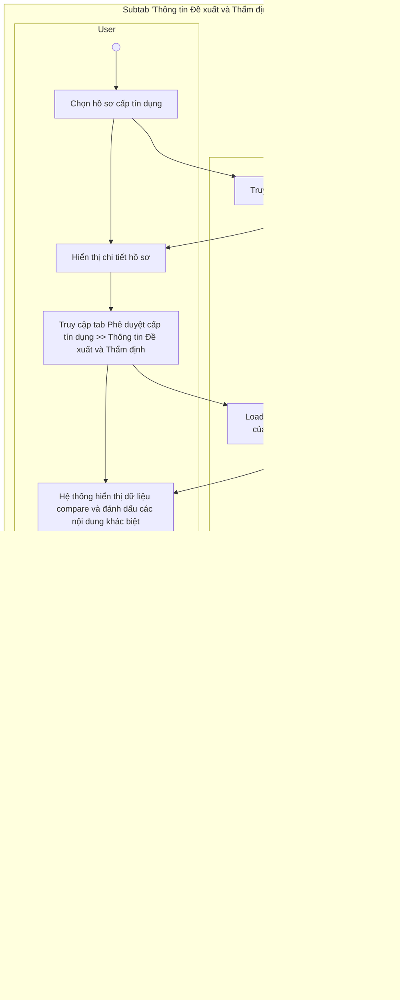

# 15.2.1. Subtab "Thông tin Đề xuất và Thẩm định"

* <u>I. Tổng quan</u>

    o <u>1. Mục tiêu</u>

    o <u>2. Phạm vi tài liệu</u>

* <u>II. Cấu trúc hiển thị</u>

* <u>III. Luồng xử lý & Danh sách chức năng</u>

    o <u>1.Luồng xử lý tổng quát</u>

    o <u>2.Danh sách chức năng</u>

* <u>IV. Chi tiết chức năng</u>

    o <u>1.1. Mô tả:</u>

        - <u>Description</u>

        - icon <u>Pre-Condition(s)</u>

        - <u>Post-Condition(s)</u>

        - <u>Business rule</u>

    o <u>1.2. Màn hình Mockup</u>

    o <u>1.3. Data các trường thông tin</u>

    o <u>1.4. Flow xử lý</u>

<table>
  <tr>
    <th>
      
US

    </th>
    <th>
      
Subtab “Thông tin Đề xuất và Thẩm định” thuộc tab “Phê duyệt cấp tín dụng”

    </th>
  </tr>
  <tr>
    <td>
      
Squad team

    </td>
    <td>
      
Squad 2

    </td>
  </tr>
  <tr>
    <td>
      
Sprint dev

    </td>
    <td>
      
Sprint 15

    </td>
  </tr>
  <tr>
    <td>
      
Nghiệp vụ

    </td>
    <td>
    </td>
  </tr>
  <tr>
    <td>
      
Link Design

    </td>
    <td>
    </td>
  </tr>
  <tr>
    <td>
      
Developer team

    </td>
    <td>
      
BA:

      
UI/UX:

      
DEV:

      
QC:

    </td>
  </tr>
</table>

**BẢNG LỊCH SỬ THAY ĐỔI**

<table>
  <tr>
    <th>
    </th>
    <th>
      
<b>Ngày</b>

    </th>
    <th>
      
<b>Mô tả</b>

    </th>
    <th>
      
<b>Người thực hiện</b>

    </th>
    <th>
      
<b>Ghi chú</b>

    </th>
  </tr>
  <tr>
    <td>
      
1

    </td>
    <td>
      
23/05/2026

    </td>
    <td>
      
Tạo mới

    </td>
    <td>
      
HangNTT86

    </td>
    <td>
      
Tạo mới tài liệu

    </td>
  </tr>
</table>

# I. Tổng quan

## 1. Mục tiêu

*   **Subtab “Thông tin Đề xuất và Thẩm định”** thuộc tab “Phê duyệt cấp tín dụng” cho phép các cấp có thẩm quyền phê duyệt thực hiện rà soát, so sánh và đưa ra quyết định đối với các nội dung trọng yếu của hồ sơ cấp tín dụng trên cơ sở dữ liệu do Bộ phận Đề xuất (BPĐX) và Bộ phận Thẩm định rủi ro (BPTĐRR) trình lên.

*   **Subtab này là cơ sở để:**

    

    o Hiển thị tổng quan các nội dung trọng yếu phục vụ công tác phê duyệt;

    

    o Hỗ trợ cấp phê duyệt nhận diện nhanh các nội dung khác biệt giữa BPĐX và BPTĐRR;

    

    o Hỗ trợ lựa chọn phương án xử lý đối với từng nội dung phê duyệt;

    

    o Hỗ trợ cấp phê duyệt nhập trực tiếp nội dung “Ý kiến khác” đối với từng nội dung;

    

    o Hỗ trợ preview nội dung Quyết định cấp tín dụng trước khi thực hiện phê duyệt;

    

    o Phục vụ ghi nhận nội dung quyết định cấp tín dụng cuối cùng của cấp có thẩm quyền.

## 2. Phạm vi tài liệu

*   Tài liệu này mô tả các nguyên tắc nghiệp vụ của Subtab **“Thông tin Đề xuất và Thẩm định”** thuộc tab “Phê duyệt cấp tín dụng”, áp dụng chung cho các nhóm luồng:

    

    o Nhóm 1 – Luồng phê duyệt cá nhân;

    

    o Nhóm 2 – Luồng Hội đồng thông thường;

    

    o Nhóm 3 – Luồng HĐQT thông qua.

* Subtab này kế thừa và tuân thủ các nguyên tắc chung đã được quy định tại **RSD Master – Khối Ý kiến Bộ phận Phê duyệt**: <u>/wiki/spaces/ps0142025/pages/2151809327</u>

# II. Cấu trúc hiển thị

* Subtab **“Thông tin Đề xuất và Thẩm định”** hiển thị tại các bước thuộc Bộ phận Phê duyệt nhằm hỗ trợ NSD rà soát, so sánh và đưa ra quyết định đối với các nội dung trọng yếu của hồ sơ cấp tín dụng trước khi thực hiện phê duyệt/thông qua hồ sơ.
* Subtab này được thiết kế theo mô hình màn hình xử lý tập trung, cho phép cấp phê duyệt thực hiện xuyên suốt các tác vụ:
    * o Rà soát tổng quan hồ sơ;
    * o Xem tóm tắt các nội dung trọng yếu theo ý kiến trình của BPĐX và BPTĐRR;
    * o Nhận diện các nội dung khác biệt;
    * o Lựa chọn phương án phê duyệt đối với những nội dung khác biệt;
    * o Nhập trực tiếp nội dung phê duyệt;
    * o Preview nội dung Quyết định cấp tín dụng trước khi phê duyệt.
* Dữ liệu hiển thị tại subtab được lấy theo version latest của từng bộ phận tại thời điểm hồ sơ được cấp phê duyệt tiếp nhận xử lý, bao gồm:
    * o Dữ liệu đề xuất của BPĐX;
    * o Dữ liệu thẩm định của BPTĐRR;
    * o Dữ liệu version của Bộ phận Phê duyệt (nếu đã tồn tại);
    * o Dữ liệu tài liệu tín dụng và các thông tin liên quan của hồ sơ.
    * Subtab bao gồm các nhóm thông tin:
        * o **Thông tin khách hàng;**
        * o **Tài liệu liên quan;**
        * o **Khoản cấp tín dụng;**
        * o **Biện pháp bảo đảm;**
        * o **Điều kiện tín dụng.**

<table>
  <thead>
    <tr>
        <th colspan="2">Nhóm thông tin</th>
        <th>Mô tả</th>
    </tr>
  </thead>
  <tbody>
    <tr>
        <td rowspan="3">1</td>
        <td rowspan="3"><strong>Thông tin khách hàng</strong></td>
        <td>* Hiển thị thông tin tổng quan của khách hàng phục vụ cấp phê duyệt rà soát nhanh hồ sơ, bao gồm: Loại hình khách hàng, Ngành nghề kinh doanh, Địa chỉ, Nhóm nợ hiện tại,...</td>
    </tr>
    <tr>
        <td>* Dữ liệu được hiển thị theo version latest của hồ sơ tại thời điểm tiếp nhận xử lý.</td>
    </tr>
    <tr>
        <td>* Cho phép NSD click hyperlink để điều hướng sang tab “Thông tin khách hàng” trong cùng context hồ sơ.</td>
    </tr>
  </tbody>
</table>

<table>
  <tbody>
    <tr>
        <td>2 <strong>Tài liệu liên quan</strong></td>
        <td>* Hiển thị danh sách rút gọn các tài liệu trọng yếu của hồ sơ phục vụ cấp phê duyệt rà soát nhanh trong quá trình xử lý hồ sơ (mặc định hiển thị danh mục gồm BCĐXTD, BCTĐTD)   * Dữ liệu được kế thừa từ tab “Tài liệu tín dụng” theo phạm vi tài liệu NSD được phân quyền truy cập.   * Cho phép NSD thực hiện các chức năng:   o Xem tài liệu;   o Download tài liệu.   * Cho phép NSD click hyperlink để điều hướng sang tab “Tài liệu tín dụng”</td>
    </tr>
    <tr>
        <td>3 <strong>Khoản cấp tín dụng</strong></td>
        <td>* Hiển thị tổng quan các chỉ tiêu trọng yếu của khoản cấp tín dụng dưới dạng compare view giữa:   o Đề xuất của BPĐX;   o Đề xuất của BPTĐRR;   o Quyết định cuối cùng của BPPD.   * Khối bao gồm các chỉ tiêu như: Số tiền cấp tín dụng, Thời hạn cấp tín dụng, Mục đích cấp tín dụng, Thời hạn rút vốn, Thời gian ân hạn, Vốn chủ sở hữu tham gia, Vốn vay tham gia,...   * Đối với các chỉ tiêu có phát sinh khác biệt giữa BPĐX và BPTĐRR:   o Hệ thống hiển thị trạng thái màu cảnh báo khác biệt;   o Cho phép NSD lựa chọn phương án xử lý đối với từng chỉ tiêu;   o Hỗ trợ nhập liệu nội dung phê duyệt trực tiếp thông qua popup nhập liệu trường hợp có ý kiến khác</td>
    </tr>
    <tr>
        <td>4 <strong>Biện pháp bảo đảm</strong></td>
        <td>* Hiển thị tổng quan các chỉ tiêu trọng yếu về chính sách bảo đảm dưới dạng compare view giữa:   o Đề xuất của BPĐX;   o Đề xuất của BPTĐRR;   o Quyết định cuối cùng của BPPD.   * Nhóm bao gồm các chỉ tiêu như: Chính sách tỷ lệ TSBĐ yêu cầu, Tỷ lệ TSBĐ thực tế, Chính sách bảo đảm đề xuất, ...   * Đối với các chỉ tiêu có phát sinh khác biệt giữa BPĐX và BPTĐRR:   o Hệ thống hiển thị trạng thái màu cảnh báo khác biệt;   o Cho phép NSD lựa chọn phương án xử lý đối với từng chỉ tiêu;   o Hỗ trợ nhập liệu nội dung phê duyệt trực tiếp thông qua popup nhập liệu trường hợp có ý kiến khác.   * Cho phép NSD click hyperlink “Danh sách TSBĐ đề xuất” để hiển thị popup danh sách TSBĐ đề xuất của hồ sơ.</td>
    </tr>
  </tbody>
</table>

<table>
  <tr>
    <th>
      <ul>
        <li><b>Subtab “Thông tin Đề xuất và Thẩm định”hiển thị tại các bước thuộc Bộ phận Phê duyệt nhằm hỗ trợ NSD rà soát, so sánh và đưa ra quyết định đối với các nội dung trọng yếu của hồ sơ cấp tín dụng trước khi thực hiện phê duyệt/thông qua hồ sơ.</b></li>
        <li><b>Subtab này được thiết kế theo mô hình màn hình xử lý tập trung, cho phép cấp phê duyệt thực hiện xuyên suốt các tác vụ:</b></li>
        <ul>
          <li><b>Rà soát tổng quan hồ sơ;</b></li>
          <li><b>Xem tóm tắt các nội dung trọng yếu theo ý kiến trình của BPĐX và BPTĐRR;</b></li>
          <li><b>Nhận diện các nội dung khác biệt;</b></li>
          <li><b>Lựa chọn phương án phê duyệt đối với những nội dung khác biệt;</b></li>
          <li><b>Nhập trực tiếp nội dung phê duyệt;</b></li>
          <li><b>Preview nội dung Quyết định cấp tín dụng trước khi phê duyệt.</b></li>
        </ul>
        <li><b>Dữ liệu hiển thị tại subtab được lấy theo version latest của từng bộ phận tại thời điểm hồ sơ được cấp phê duyệt tiếp nhận xử lý, bao gồm:</b></li>
        <ul>
          <li><b>Dữ liệu đề xuất của BPĐX;</b></li>
          <li><b>Dữ liệu thẩm định của BPTĐRR;</b></li>
          <li><b>Dữ liệu version của Bộ phận Phê duyệt (nếu đã tồn tại);</b></li>
          <li><b>Dữ liệu tài liệu tín dụng và các thông tin liên quan của hồ sơ.</b></li>
        </ul>
        <li><b>Subtab bao gồm các nhóm thông tin:</b></li>
        <ul>
          <li><b>Thông tin khách hàng;</b></li>
          <li><b>Tài liệu liên quan;</b></li>
          <li><b>Khoản cấp tín dụng;</b></li>
          <li><b>Biện pháp bảo đảm;</b></li>
          <li><b>Điều kiện tín dụng.</b></li>
        </ul>
      </ul>
    </th>
  </tr>
</table>

# III. Luồng xử lý & Danh sách chức năng

## 1. Luồng xử lý tổng quát

## 2. Danh sách chức năng

<table>
  <tr>
    <th>
    </th>
    <th>
      
<b>Nhóm thông tin</b>

    </th>
    <th>
      
<b>Mô tả</b>

    </th>
  </tr>
  <tr>
    <td>
      
1

    </td>
    <td>
      
Thông tin khách hàng

    </td>
    <td>
      <ul>
        <li>Hiển thị thông tin tổng quan của khách hàng phục vụ cấp phê duyệt rà soát nhanh hồ sơ, bao gồm: Loại hình khách hàng, Ngành nghề kinh doanh, Địa chỉ, Nhóm nợ hiện tại,...</li>
        <li>Dữ liệu được hiển thị theo version latest của hồ sơ tại thời điểm tiếp nhận xử lý.</li>
        <li>Cho phép NSD click hyperlink để điều hướng sang tab “Thông tin khách hàng” trong cùng context hồ sơ.</li>
      </ul>
    </td>
  </tr>
  <tr>
    <td>
      
2

    </td>
    <td>
      
Tài liệu liên quan

    </td>
    <td>
      <ul>
        <li>Hiển thị danh sách rút gọn các tài liệu trọng yếu của hồ sơ phục vụ cấp phê duyệt rà soát nhanh trong quá trình xử lý hồ sơ (mặc định hiển thị danh mục gồm BCĐXTD, BCTĐTD)</li>
        <li>Dữ liệu được kế thừa từ tab “Tài liệu tín dụng” theo phạm vi tài liệu NSD được phân quyền truy cập.</li>
        <li>Cho phép NSD thực hiện các chức năng:</li>
        <ul>
          <li>Xem tài liệu;</li>
          <li>Download tài liệu.</li>
        </ul>
        <li>Cho phép NSD click hyperlink để điều hướng sang tab “Tài liệu tín dụng”</li>
      </ul>
    </td>
  </tr>
</table>

<table>
  <tbody>
    <tr>
        <td>3</td>
        <td>Hiển thị nội dung khác biệt</td>
        <td>Hệ thống tự động xác định và đánh dấu các chỉ tiêu có khác biệt giữa BPĐX và BPTĐRR tại các nhóm Khoản cấp tín dụng, Biện pháp bảo đảm và Điều kiện tín dụng.</td>
    </tr>
    <tr>
        <td>4</td>
        <td>Xem tài liệu liên quan</td>
        <td>Cho phép NSD xem/download các tài liệu trọng yếu của hồ sơ tại nhóm “Tài liệu liên quan”.</td>
    </tr>
    <tr>
        <td>5</td>
        <td>Điều hướng sang màn hình nghiệp vụ chi tiết</td>
        <td>Cho phép NSD click hyperlink để điều hướng sang các tab nghiệp vụ tương ứng (Thông tin khách hàng/Tài liệu tín dụng) trong cùng context hồ sơ.</td>
    </tr>
    <tr>
        <td>6</td>
        <td>Lựa chọn phương án xử lý</td>
        <td>Cho phép NSD thuộc Bộ phận Phê duyệt lựa chọn phương án xử lý đối với từng chỉ tiêu khác biệt bao gồm: * Thống nhất BPĐX * Thống nhất BPTĐRR * Ý kiến khác.</td>
    </tr>
    <tr>
        <td>7</td>
        <td>Nhập liệu ý kiến phê duyệt</td>
        <td>Trường hợp NSD có “Ý kiến khác”, hệ thống hiển thị popup nhập liệu cho phép NSD nhập/chỉnh sửa dữ liệu theo ý kiến phê duyệt.</td>
    </tr>
    <tr>
        <td>8</td>
        <td>Lưu dữ liệu subtab <strong>“Thông tin Đề xuất và Thẩm định”</strong></td>
        <td>* Cho phép NSD tại <strong>bước có quyền Edit của bộ phận BPPDTD</strong> thực hiện lưu dữ liệu tại subtab * Khi thực hiện lưu:   - Hệ thống kiểm tra tính hợp lệ của dữ liệu     - Trường hợp dữ liệu <strong>chưa hợp lệ</strong>: vẫn cho phép lưu dưới dạng <strong>nháp</strong>     - Trường hợp dữ liệu <strong>hợp lệ</strong>: lưu và đánh dấu trạng thái <strong>hoàn thành</strong> * Dữ liệu được lưu theo cơ chế version của BPPDTD, không ghi đè dữ liệu đề xuất.</td>
    </tr>
    <tr>
        <td>9</td>
        <td>Tự động cập nhật dữ liệu Quyết định sang subtab “Quyết định phê duyệt”</td>
        <td>Sau khi NSD lưu khối thành công, hệ thống xử lý: * Trường hợp đồng ý với version BPĐX, dữ liệu tại các nhóm khoản tín dụng, chính sách bảo đảm, điều kiện tín dụng được cập nhật lại theo version BPĐX * Trường hợp đưa ý kiến khác, NSD thuộc BPPDTD trực tiếp chỉnh sửa dữ liệu tại nhóm khoản tín dụng, chính sách bảo đảm, điều kiện tín dụng</td>
    </tr>
  </tbody>
</table>

# IV. Chi tiết chức năng

Click here to expand...

## 1.1. Mô tả:

<table>
  <thead>
    <tr>
        <th>Description</th>
        <th>* Subtab "<strong>Thông tin Đề xuất và Thẩm định</strong>" thuộc tab "Phê duyệt cấp tín dụng" hỗ trợ cấp có thẩm quyền rà soát, so sánh và đưa ra quyết định đối với các nội dung trọng yếu của hồ sơ cấp tín dụng trước khi thực hiện phê duyệt/thông qua hồ sơ. * Tại subtab này, hệ thống hiển thị dữ liệu compare giữa BPDX, BPTĐRR và Quyết định của Cấp có thẩm quyền đối với các nhóm dữ liệu:     o Khoản tín dụng;     o Biện pháp bảo đảm;     o Điều kiện tín dụng. * Cho phép NSD:     o Rà soát dữ liệu hồ sơ;     o Lựa chọn phương án xử lý đối với từng nội dung khác biệt;     o Nhập/chỉnh sửa dữ liệu phê duyệt;     o Xem tài liệu liên quan;     o Preview Quyết định cấp tín dụng trước khi phê duyệt. * Dữ liệu tại subtab được lưu theo cơ chế version của Bộ phận Phê duyệt và không ghi đè dữ liệu nguồn của BPDX/BPTĐRR.</th>
    </tr>
  </thead>
  <tbody>
    <tr>
        <td rowspan="2">Pre-Condition(s)</td>
        <td>Hồ sơ thỏa mãn các điều kiện sau: * NSD đăng nhập thành công vào hệ thống Lending Hub; * Bước hiện tại của hồ sơ thuộc Bộ phận Phê duyệt; NSD được phân công xử lý hồ sơ tại bước hiện tại; * NSD vào tab "Phê duyệt tín dụng" &gt;&gt; subtab "Thông tin Đề xuất và Thẩm định"; * Hồ sơ đã tồn tại dữ liệu:     o tồn tại bộ dữ liệu đầu vào từ BPDX, BPTĐRR hoặc tồn tại bộ dữ liệu hiện hữu từ Core Banking (đối với điều chỉnh tín dụng), bao gồm:         • Cấu trúc khoản tín dụng;         • dữ liệu tài sản bảo đảm;         • dữ liệu điều kiện tín dụng;     o Tài liệu tín dụng;</td>
    </tr>
    <tr>
        <td>NSD được phân quyền truy cập/xử lý hồ sơ theo nguyên tắc phân quyền chung của hệ thống: /wiki/spaces/ps0142025/pages/2151809327</td>
    </tr>
  </tbody>
</table>

<table>
  <tr>
    <th>
      
3

    </th>
    <th>
      
Khoản cấp tín dụng

    </th>
    <th>
      <ul>
        <li>Hiển thị tổng quan các chỉ tiêu trọng yếu của khoản cấp tín dụng dưới dạng compare view giữa:</li>
        <ul>
          <li>Đề xuất của BPĐX;</li>
          <li>Đề xuất của BPTĐRR;</li>
          <li>Quyết định cuối cùng của BPPD.</li>
        </ul>
        <li>Khối bao gồm các chỉ tiêu như: Số tiền cấp tín dụng, Thời hạn cấp tín dụng, Mục đích cấp tín dụng, Thời hạn rút vốn, Thời gian ân hạn, Vốn chủ sở hữu tham gia, Vốn vay tham gia,...</li>
        <li>Đối với các chỉ tiêu có phát sinh khác biệt giữa BPĐX và BPTĐRR:</li>
        <ul>
          <li>Hệ thống hiển thị trạng thái màu cảnh báo khác biệt;</li>
          <li>Cho phép NSD lựa chọn phương án xử lý đối với từng chỉ tiêu;</li>
          <li>Hỗ trợ nhập liệu nội dung phê duyệt trực tiếp thông qua popup nhập liệu trường hợp có ý kiến khác</li>
        </ul>
      </ul>
    </th>
  </tr>
  <tr>
    <td>
      
4

    </td>
    <td>
      
Biện pháp bảo đảm

    </td>
    <td>
      <ul>
        <li>Hiển thị tổng quan các chỉ tiêu trọng yếu về chính sách bảo đảm dưới dạng compare view giữa:</li>
        <ul>
          <li>Đề xuất của BPĐX;</li>
          <li>Đề xuất của BPTĐRR;</li>
          <li>Quyết định cuối cùng của BPPD.</li>
        </ul>
        <li>Nhóm bao gồm các chỉ tiêu như: Chính sách tỷ lệ TSBĐ yêu cầu, Tỷ lệ TSBĐ thực tế,Chính sách bảo đảm đề xuất, …</li>
        <li>Đối với các chỉ tiêu có phát sinh khác biệt giữa BPĐX và BPTĐRR:</li>
        <ul>
          <li>Hệ thống hiển thị trạng thái màu cảnh báo khác biệt;</li>
          <li>Cho phép NSD lựa chọn phương án xử lý đối với từng chỉ tiêu;</li>
          <li>Hỗ trợ nhập liệu nội dung phê duyệt trực tiếp thông qua popup nhập liệu trường hợp có ý kiến khác.</li>
        </ul>
        <li>Cho phép NSD click hyperlink “Danh sách TSBĐ đề xuất” để hiển thị popup danh sách TSBĐ đề xuất của hồ sơ.</li>
      </ul>
    </td>
  </tr>
  <tr>
    <td>
      
5

    </td>
    <td>
      
Điều kiện tín dụng

    </td>
    <td>
      <ul>
        <li>Hiển thị tổng quan danh sách các điều kiện tín dụng trọng yếu dưới dạng compare view giữa:</li>
        <ul>
          <li>Đề xuất của BPĐX;</li>
          <li>Đề xuất của BPTĐRR;</li>
          <li>Quyết định cuối cùng của BPPD.</li>
        </ul>
        <li>Dữ liệu được tổ chức theo từng nhóm điều kiện nghiệp vụ, bao gồm:</li>
        <ul>
          <li>Điều kiện cấp tín dụng;</li>
          <li>Biện pháp bảo đảm;</li>
          <li>Nội dung cấp tín dụng.</li>
        </ul>
        <li>Đối với các điều kiện có phát sinh khác biệt giữa BPĐX và BPTĐRR:</li>
        <ul>
          <li>Hệ thống hiển thị trạng thái cảnh báo khác biệt;</li>
          <li>Cho phép NSD lựa chọn phương án xử lý đối với từng điều kiện;</li>
          <li>Hỗ trợ nhập liệu/chỉnh sửa điều kiện trực tiếp thông qua popup nhập liệu.</li>
        </ul>
        <li>Cho phép NSD sử dụng tính năng xem toàn bộ danh sách điều kiện thông qua toggle “Xem toàn bộ”.</li>
      </ul>
    </td>
  </tr>
</table>

Bullet point icon

Bullet point icon

<table>
    <tr>
        <th>Post-Condition icon **Post-Condition(s)**</th>
        <th>Sau khi NSD lưu dữ liệu tại subtab **“Thông tin Đề xuất và Thẩm định”**:     \* Bộ dữ liệu cuối cùng được lưu;   \* Trạng thái kiểm tra dữ liệu được cập nhật;   \* Bản xem trước payload được tạo;   \* Bộ dữ liệu liên kết được lưu;   \* Phiên bản bộ dữ liệu được ghi nhận.   \* Không làm thay đổi dữ liệu nguồn của BPĐX và BPTĐRR;   \* Ghi nhận log thao tác của NSD;     Đối với hồ sơ điều chỉnh:     \* Bộ dữ liệu điều chỉnh cuối cùng được tạo;   \* Chênh lệch điều chỉnh được lưu;   \* Phiên bản điều chỉnh được lưu.     Dữ liệu sẵn sàng phục vụ:     \* Preview Quyết định cấp tín dụng;   \* Trình duyệt/phê duyệt hồ sơ;   \* Các bước xử lý tiếp theo của quy trình.</th>
    </tr>
</table>
<table>
    <tr>
        <th>Business rule icon **Business rule**</th>
        <th>**1.Nguyên tắc load compare dữ liệu**     \* Subtab **“Thông tin Đề xuất và Thẩm định”** hiển thị dữ liệu theo version latest tương ứng của từng nguồn dữ liệu tại thời điểm hồ sơ được cấp phê duyệt tiếp nhận xử lý, bao gồm:   o Dữ liệu đề xuất của BPĐX;   o Dữ liệu thẩm định của BPTĐRR;   o Ý kiến khác của cấp phê duyệt (nếu đã có - trường hợp nhận trình lại).   o Đối với hồ sơ điều chỉnh:   - compare thêm Current Datase.   \* Phạm vi compare áp dụng đối với các nhóm:   o Khoản tín dụng;   o Biện pháp bảo đảm;   o Điều kiện tín dụng.   \* Hệ thống chỉ thực hiện compare đối với các chỉ tiêu/các nội dung được cấu hình thuộc phạm vi compare phục vụ cấp phê duyệt rà soát và ra quyết định.   \* Danh sách chỉ tiêu compare được mô tả chi tiết tại mục 1.3.   \* Đối với các chỉ tiêu có phát sinh khác biệt giữa BPĐX và BPTĐRR:   o Hệ thống hiển thị trạng thái cảnh báo khác biệt;   o Hiển thị lựa chọn phương án xử lý tương ứng cho NSD.   \* Trường hợp không phát sinh khác biệt:</th>
    </tr>
</table>

<table>
  <tr>
    <th>
      
5

    </th>
    <th>
      
Điều kiện tín dụng

    </th>
    <th>
      <ul>
        <li>Hiển thị tổng quan danh sách các điều kiện tín dụng trọng yếu dưới dạng compare view giữa:</li>
        <ul>
          <li>Đề xuất của BPĐX;</li>
          <li>Đề xuất của BPTĐRR;</li>
          <li>Quyết định cuối cùng của BPPD.</li>
        </ul>
        <li>Dữ liệu được tổ chức theo từng nhóm điều kiện nghiệp vụ, bao gồm:</li>
        <ul>
          <li>Điều kiện cấp tín dụng;</li>
          <li>Biện pháp bảo đảm;</li>
          <li>Nội dung cấp tín dụng.</li>
        </ul>
        <li>Đối với các điều kiện có phát sinh khác biệt giữa BPĐX và BPTĐRR:</li>
        <ul>
          <li>Hệ thống hiển thị trạng thái cảnh báo khác biệt;</li>
          <li>Cho phép NSD lựa chọn phương án xử lý đối với từng điều kiện;</li>
          <li>Hỗ trợ nhập liệu/chỉnh sửa điều kiện trực tiếp thông qua popup nhập liệu.</li>
        </ul>
        <li>Cho phép NSD sử dụng tính năng xem toàn bộ danh sách điều kiện thông qua toggle “Xem toàn bộ”.</li>
      </ul>
    </th>
  </tr>
</table>

<table>
  <tr>
    <th>
    </th>
    <th>
      
<b>Use Case</b>

    </th>
    <th>
      
<b>Mô tả</b>

    </th>
  </tr>
</table>

<table>
  <tr>
    <th>
      
1

    </th>
    <th>
      
Xem nội dung Đề xuất và Thẩm định

    </th>
    <th>
      
Cho phép NSD tại các bước thuộc Bộ phận Phê duyệt xem tổng quan các nội dung trọng yếu của hồ sơ cấp tín dụng theo ý kiến của BPĐX và BPTĐRR

    </th>
  </tr>
  <tr>
    <td>
      
2

    </td>
    <td>
      
Tự động compare dữ liệu

    </td>
    <td>
      
Hệ thống tự động compare dữ liệu giữa BPĐX và BPTĐRR theo danh mục compare được cấu hình dựa trên version latest tại thời điểm Bộ phận Phê duyệt tiếp nhận xử lý hồ sơ.

    </td>
  </tr>
</table>

<table>
  <tr>
    <th>
      
2

    </th>
    <th>
      
Tự động compare dữ liệu

    </th>
    <th>
      
Hệ thống tự động compare dữ liệu giữa BPĐX và BPTĐRR theo danh mục compare được cấu hình dựa trên version latest tại thời điểm Bộ phận Phê duyệt tiếp nhận xử lý hồ sơ.

    </th>
  </tr>
  <tr>
    <td>
      
3

    </td>
    <td>
      
Hiển thị nội dung khác biệt

    </td>
    <td>
      
Hệ thống tự động xác định và đánh dấu các chỉ tiêu có khác biệt giữa BPĐX và BPTĐRR tại các nhóm Khoản cấp tín dụng, Biện pháp bảo đảm và Điều kiện tín dụng.

    </td>
  </tr>
  <tr>
    <td>
      
4

    </td>
    <td>
      
Xem tài liệu liên quan

    </td>
    <td>
      
Cho phép NSD xem/download các tài liệu trọng yếu của hồ sơ tại nhóm “Tài liệu liên quan”.

    </td>
  </tr>
  <tr>
    <td>
      
5

    </td>
    <td>
      
Điều hướng sang màn hình nghiệp vụ chi tiết

    </td>
    <td>
      
Cho phép NSD click hyperlink để điều hướng sang các tab nghiệp vụ tương ứng (Thông tin khách hàng/Tài liệu tín dụng) trong cùng context hồ sơ.

    </td>
  </tr>
</table>

## 1.2. Màn hình Mockup

Link Figma: <u>https://www.figma.com/design/PXt1aa5gAeWjyYKmiwN7i5/-W--Squad-2--Lu%E1%BB%93ng-ph%C3%AA-duy%E1%BB%87t?node-id=8053-622241&t=KmMKIdjBpY7DSHTl-4</u>

<table>
  <tr>
    <th>
      
4

    </th>
    <th>
      
Xem tài liệu liên quan

    </th>
    <th>
      
Cho phép NSD xem/download các tài liệu trọng yếu của hồ sơ tại nhóm “Tài liệu liên quan”.

    </th>
  </tr>
  <tr>
    <td>
      
5

    </td>
    <td>
      
Điều hướng sang màn hình nghiệp vụ chi tiết

    </td>
    <td>
      
Cho phép NSD click hyperlink để điều hướng sang các tab nghiệp vụ tương ứng (Thông tin khách hàng/Tài liệu tín dụng) trong cùng context hồ sơ.

    </td>
  </tr>
  <tr>
    <td>
      
6

    </td>
    <td>
      
Lựa chọn phương án xử lý

    </td>
    <td>
      
Cho phép NSD thuộc Bộ phận Phê duyệt lựa chọn phương án xử lý đối với từng chỉ tiêu khác biệt bao gồm:

      <ul>
        <li>Thống nhất BPĐX</li>
        <li>Thống nhất BPTĐRR</li>
        <li>Ý kiến khác.</li>
      </ul>
    </td>
  </tr>
  <tr>
    <td>
      
7

    </td>
    <td>
      
Nhập liệu ý kiến phê duyệt

    </td>
    <td>
      
Trường hợp NSD có “Ý kiến khác”, hệ thống hiển thị popup nhập liệu cho phép NSD nhập/chỉnh sửa dữ liệu theo ý kiến phê duyệt.

    </td>
  </tr>
  <tr>
    <td>
      
8

    </td>
    <td>
      
Lưu dữ liệu subtab“Thông tin Đề xuất và Thẩm định”

    </td>
    <td>
      <ul>
        <li>Cho phép NSD tạibước có quyền Edit của bộ phận BPPDTDthực hiện lưu dữ liệu tại subtab</li>
        <li>Khi thực hiện lưu:</li>
        <ul>
          <li>Hệ thống kiểm tra tính hợp lệ của dữ liệu</li>
          <ul>
            <li>Trường hợp dữ liệuchưa hợp lệ: vẫn cho phép lưu dưới dạngnháp</li>
            <li>Trường hợp dữ liệuhợp lệ: lưu và đánh dấu trạng tháihoàn thành</li>
          </ul>
        </ul>
        <li>Dữ liệu được lưu theo cơ chế version của BPPDTD, không ghi đè dữ liệu đề xuất.</li>
      </ul>
    </td>
  </tr>
</table>

<table>
  <tr>
    <th>
      
5

    </th>
    <th>
      
Điều hướng sang màn hình nghiệp vụ chi tiết

    </th>
    <th>
      
Cho phép NSD click hyperlink để điều hướng sang các tab nghiệp vụ tương ứng (Thông tin khách hàng/Tài liệu tín dụng) trong cùng context hồ sơ.

    </th>
  </tr>
  <tr>
    <td>
      
6

    </td>
    <td>
      
Lựa chọn phương án xử lý

    </td>
    <td>
      
Cho phép NSD thuộc Bộ phận Phê duyệt lựa chọn phương án xử lý đối với từng chỉ tiêu khác biệt bao gồm:

      <ul>
        <li>Thống nhất BPĐX</li>
        <li>Thống nhất BPTĐRR</li>
        <li>Ý kiến khác.</li>
      </ul>
    </td>
  </tr>
  <tr>
    <td>
      
7

    </td>
    <td>
      
Nhập liệu ý kiến phê duyệt

    </td>
    <td>
      
Trường hợp NSD có “Ý kiến khác”, hệ thống hiển thị popup nhập liệu cho phép NSD nhập/chỉnh sửa dữ liệu theo ý kiến phê duyệt.

    </td>
  </tr>
  <tr>
    <td>
      
8

    </td>
    <td>
      
Lưu dữ liệu subtab“Thông tin Đề xuất và Thẩm định”

    </td>
    <td>
      <ul>
        <li>Cho phép NSD tạibước có quyền Edit của bộ phận BPPDTDthực hiện lưu dữ liệu tại subtab</li>
        <li>Khi thực hiện lưu:</li>
        <ul>
          <li>Hệ thống kiểm tra tính hợp lệ của dữ liệu</li>
          <ul>
            <li>Trường hợp dữ liệuchưa hợp lệ: vẫn cho phép lưu dưới dạngnháp</li>
            <li>Trường hợp dữ liệuhợp lệ: lưu và đánh dấu trạng tháihoàn thành</li>
          </ul>
        </ul>
        <li>Dữ liệu được lưu theo cơ chế version của BPPDTD, không ghi đè dữ liệu đề xuất.</li>
      </ul>
    </td>
  </tr>
  <tr>
    <td>
      
9

    </td>
    <td>
      
Tự động cập nhật dữ liệu Quyết định sang subtab “Quyết định phê duyệt”

    </td>
    <td>
      
Sau khi NSD lưu khối thành công, hệ thống xử lý:

      <ul>
        <li>Trường hợp đồng ý với version BPĐX, dữ liệu tại các nhóm khoản tín dụng, chính sách bảo đảm, điều kiện tín dụng được cập nhật lại theo version BPĐX</li>
        <li>Trường hợp đưa ý kiến khác, NSD thuộc BPPDTD trực tiếp chỉnh sửa dữ liệu tại nhóm khoản tín dụng, chính sách bảo đảm, điều kiện tín dụng</li>
      </ul>
    </td>
  </tr>
</table>

Screenshot of a web application interface showing a detailed audit or compliance checklist with multiple sections, tables, and status indicators.

BIDV
Lê Thị Hằng
Giám đốc phê duyệt

Lending > Công việc chờ tôi xử lý > Hồ sơ trình cấp tín dụng

# < Hồ sơ trình cấp tín dụng

[Trả lại] [Phê duyệt]

**Số HS: 2193915** Loại hồ sơ: Cấp mới Chờ xử lý Bước xử lý: Phê duyệt cấp tín dụng Người xử lý: Trần Xuân Mạnh - 36375
Tổng công ty Điện lực Việt Nam - CIF 139393 XHTDNB: A Mã sơ thẩm chiếu: TD-120-24-123456 Phiên bản: 2.0

## Thông tin Đề xuất và Thẩm định

<table>
  <tr>
    <th>
      
6

    </th>
    <th>
      
Lựa chọn phương án xử lý

    </th>
    <th>
      
Cho phép NSD thuộc Bộ phận Phê duyệt lựa chọn phương án xử lý đối với từng chỉ tiêu khác biệt bao gồm:

      <ul>
        <li>Thống nhất BPĐX</li>
        <li>Thống nhất BPTĐRR</li>
        <li>Ý kiến khác.</li>
      </ul>
    </th>
  </tr>
  <tr>
    <td>
      
7

    </td>
    <td>
      
Nhập liệu ý kiến phê duyệt

    </td>
    <td>
      
Trường hợp NSD có “Ý kiến khác”, hệ thống hiển thị popup nhập liệu cho phép NSD nhập/chỉnh sửa dữ liệu theo ý kiến phê duyệt.

    </td>
  </tr>
  <tr>
    <td>
      
8

    </td>
    <td>
      
Lưu dữ liệu subtab“Thông tin Đề xuất và Thẩm định”

    </td>
    <td>
      <ul>
        <li>Cho phép NSD tạibước có quyền Edit của bộ phận BPPDTDthực hiện lưu dữ liệu tại subtab</li>
        <li>Khi thực hiện lưu:</li>
        <ul>
          <li>Hệ thống kiểm tra tính hợp lệ của dữ liệu</li>
          <ul>
            <li>Trường hợp dữ liệuchưa hợp lệ: vẫn cho phép lưu dưới dạngnháp</li>
            <li>Trường hợp dữ liệuhợp lệ: lưu và đánh dấu trạng tháihoàn thành</li>
          </ul>
        </ul>
        <li>Dữ liệu được lưu theo cơ chế version của BPPDTD, không ghi đè dữ liệu đề xuất.</li>
      </ul>
    </td>
  </tr>
  <tr>
    <td>
      
9

    </td>
    <td>
      
Tự động cập nhật dữ liệu Quyết định sang subtab “Quyết định phê duyệt”

    </td>
    <td>
      
Sau khi NSD lưu khối thành công, hệ thống xử lý:

      <ul>
        <li>Trường hợp đồng ý với version BPĐX, dữ liệu tại các nhóm khoản tín dụng, chính sách bảo đảm, điều kiện tín dụng được cập nhật lại theo version BPĐX</li>
        <li>Trường hợp đưa ý kiến khác, NSD thuộc BPPDTD trực tiếp chỉnh sửa dữ liệu tại nhóm khoản tín dụng, chính sách bảo đảm, điều kiện tín dụng</li>
      </ul>
    </td>
  </tr>
</table>

Screenshot of the BIDV credit approval system interface showing customer information, related documents, and credit limit details.

### Nhập ý kiến

**Đề xuất tỷ lệ TSBD mỗi khoản cấp tín dụng** [Theo khoản tín dụng, thời gian & số dư]

<table>
  <thead>
    <tr>
        <th>STT</th>
        <th>ID commitment</th>
        <th>Tên commitment</th>
        <th>Hạn mức (Tr VND)</th>
        <th>Thời gian &amp; khoảng dư nợ (Tr VND)</th>
    </tr>
  </thead>
  <tbody>
    <tr>
        <td>1</td>
        <td>2026-18928389</td>
        <td>Hạn mức tín dụng cho vay vốn 2025 2026</td>
        <td>12,000</td>
        <td>[x] 15/09/2025 100,000 - 500,000 (10%) [ - ] [ + ] [delete]</td>
    </tr>
    <tr>
        <td>2</td>
        <td>2026-19028389</td>
        <td>Hạn mức cho vay</td>
        <td>750,000</td>
        <td>[ + ] [delete]</td>
    </tr>
    <tr>
        <td>3</td>
        <td>2025-19028389</td>
        <td>Hạn mức bảo lãnh</td>
        <td>500,000</td>
        <td>[x] 20/09/2025 800,000 - 1,000,000 (20%) [ - ] [ + ] [delete]</td>
    </tr>
  </tbody>
</table>

[+ Thêm mới]

[Đóng] [Lưu]

BIDV
Uông Thị Hải Yến
Thư ký hội đồng

<table>
  <tr>
    <th>
      
8

    </th>
    <th>
      
Lưu dữ liệu subtab“Thông tin Đề xuất và Thẩm định”

    </th>
    <th>
      <ul>
        <li>Cho phép NSD tạibước có quyền Edit của bộ phận BPPDTDthực hiện lưu dữ liệu tại subtab</li>
        <li>Khi thực hiện lưu:</li>
        <ul>
          <li>Hệ thống kiểm tra tính hợp lệ của dữ liệu</li>
          <ul>
            <li>Trường hợp dữ liệuchưa hợp lệ: vẫn cho phép lưu dưới dạngnháp</li>
            <li>Trường hợp dữ liệuhợp lệ: lưu và đánh dấu trạng tháihoàn thành</li>
          </ul>
        </ul>
        <li>Dữ liệu được lưu theo cơ chế version của BPPDTD, không ghi đè dữ liệu đề xuất.</li>
      </ul>
    </th>
  </tr>
  <tr>
    <td>
      
9

    </td>
    <td>
      
Tự động cập nhật dữ liệu Quyết định sang subtab “Quyết định phê duyệt”

    </td>
    <td>
      
Sau khi NSD lưu khối thành công, hệ thống xử lý:

      <ul>
        <li>Trường hợp đồng ý với version BPĐX, dữ liệu tại các nhóm khoản tín dụng, chính sách bảo đảm, điều kiện tín dụng được cập nhật lại theo version BPĐX</li>
        <li>Trường hợp đưa ý kiến khác, NSD thuộc BPPDTD trực tiếp chỉnh sửa dữ liệu tại nhóm khoản tín dụng, chính sách bảo đảm, điều kiện tín dụng</li>
      </ul>
    </td>
  </tr>
</table>

## 1.3. Data các trường thông tin

<table>
  <thead>
    <tr>
        <th>STT</th>
        <th>Hạng mục</th>
        <th>Định dạng</th>
        <th>Kiểu thao tác</th>
        <th>Bắt buộc (M/O)</th>
        <th>Độ dài</th>
        <th>Giá trị mặc định</th>
    </tr>
  </thead>
  <tbody>
    <tr>
        <td colspan="7">1.Nhóm “Thông tin khách hàng”</td>
    </tr>
  </tbody>
</table>

<table>
  <tbody>
    <tr>
        <td>1</td>
        <td>Loại hình khách hàng</td>
        <td>Text</td>
        <td>Hiển thị</td>
        <td>O</td>
        <td>-</td>
        <td>-</td>
        <td>* Hiển thị theo dữ liệu latest hồ sơ. * Đối với KHDN: Lấy từ trường “Loại hình doanh nghiệp” tại Tab “Thông tin khách hàng” → Subtab “Thông tin phi tài chính”. * Đối với TCTD: Lấy từ trường “Loại hình tổ chức” tại Tab “Thông tin khách hàng” → Subtab “Thông tin phi tài chính”.</td>
    </tr>
    <tr>
        <td>2</td>
        <td>Ngành nghề kinh doanh</td>
        <td>Text</td>
        <td>Hiển thị</td>
        <td>O</td>
        <td>-</td>
        <td>-</td>
        <td>* Hiển thị theo dữ liệu latest hồ sơ. * Đối với KHDN: Lấy từ trường “Ngành nghề trên Core” tại Tab “Thông tin khách hàng” → Subtab “Thông tin phi tài chính”. * Đối với TCTD: hiển thị null</td>
    </tr>
    <tr>
        <td>3</td>
        <td>Địa chỉ</td>
        <td>Text</td>
        <td>Hiển thị</td>
        <td>O</td>
        <td>-</td>
        <td>-</td>
        <td>* Hiển thị theo dữ liệu latest hồ sơ. * Đối với KHDN: Lấy từ trường “Địa chỉ khách hàng” tại Tab “Thông tin khách hàng” → Subtab “Thông tin phi tài chính”. * Đối với TCTD: Lấy từ trường “Địa chỉ” tại Tab “Thông tin khách hàng” → Subtab “Thông tin phi tài chính”.</td>
    </tr>
    <tr>
        <td>4</td>
        <td>Nhóm nợ hiện tại</td>
        <td>Text</td>
        <td>Hiển thị</td>
        <td>O</td>
        <td>-</td>
        <td>-</td>
        <td>* Hiển thị theo dữ liệu latest hồ sơ. * Lấy từ trường “Nhóm nợ” tại Tab “Thông tin khách hàng” → Subtab “Quan hệ tại BIDV”.</td>
    </tr>
    <tr>
        <td colspan="8"><strong>2. Nhóm “Tài liệu liên quan”</strong></td>
    </tr>
    <tr>
        <td>1</td>
        <td>Danh sách tài liệu liên quan</td>
        <td>Hyperlink file</td>
        <td>Preview/Download</td>
        <td>O</td>
        <td>-</td>
        <td>-</td>
        <td>* Hiển thị danh sách rút gọn các tài liệu trọng yếu phục vụ cấp phê duyệt rà soát hồ sơ. * Mặc định hiển thị các loại tài liệu: - Báo cáo ĐXTD - Báo cáo TĐRR * Dữ liệu được kế thừa từ tab “Tài liệu tín dụng”. Cho phép NSD preview/download file theo phân quyền truy cập tài liệu.</td>
    </tr>
    <tr>
        <td>2</td>
        <td>Xem thêm tài liệu</td>
        <td>Hyperlink</td>
        <td>Click</td>
        <td>O</td>
        <td> </td>
        <td>-</td>
        <td>* Hiển thị số lượng tài liệu còn lại ngoài danh sách mặc định. * Cho phép NSD click để điều hướng sang tab “Tài liệu tín dụng” trong cùng context hồ sơ.</td>
    </tr>
    <tr>
        <td colspan="8"><strong>3. Nhóm “Khoản cấp tín dụng”</strong></td>
    </tr>
    <tr>
        <td colspan="8">* Hiển thị danh sách các chỉ tiêu trọng yếu của khoản cấp tín dụng phục vụ cấp phê duyệt rà soát và ra quyết định. * Đảm bảo tuân thủ các nội dung mô tả ở Business rule icon <strong>Business rule tại mục 1,4,5,6,7</strong></td>
    </tr>
    <tr>
        <td colspan="8"><strong>3.1. Cấu trúc bảng</strong></td>
    </tr>
    <tr>
        <td>3.1.1</td>
        <td>STT</td>
        <td>Number</td>
        <td>Hiển thị</td>
        <td>O</td>
        <td>-</td>
        <td>-</td>
        <td>Hiển thị số thứ tự của chỉ tiêu compare.</td>
    </tr>
    <tr>
        <td>3.1.2</td>
        <td>Nội dung</td>
        <td>Text</td>
        <td>Hiển thị</td>
        <td>O</td>
        <td>-</td>
        <td>-</td>
        <td>Hiển thị tên chỉ tiêu compare khoản cấp tín dụng. Chi tiết chỉ tiêu mô tả tại bảng Danh sách chỉ tiêu bên dưới</td>
    </tr>
  </tbody>
</table>

<table>
  <tbody>
    <tr>
        <td>3.1.3</td>
        <td>Đề xuất của BPĐX</td>
        <td>Text</td>
        <td>Hiển thị/Tick</td>
        <td>O</td>
        <td>-</td>
        <td>-</td>
        <td>* Hiển thị dữ liệu từng nội dung đề xuất khoản cấp tín dụng của BPĐX theo version latest tại thời điểm load hồ sơ. * Trường hợp dữ liệu có phát sinh khác biệt giữa BPĐX và BPTĐRR:   - Hệ thống hiển thị trạng thái cảnh báo khác biệt tại chỉ tiêu tương ứng;   - Cho phép NSD tick chọn để thống nhất với dữ liệu của BPĐX. * Trường hợp dữ liệu không phát sinh khác biệt giữa BPĐX và BPTĐRR:   - Hệ thống hiển thị dữ liệu readonly;   - Không hiển thị trạng thái cảnh báo khác biệt;   - Không hiển thị lựa chọn phương án xử lý.</td>
        <td></td>
    </tr>
    <tr>
        <td>3.1.4</td>
        <td>Đề xuất của BPTĐRR</td>
        <td>Text</td>
        <td>Hiển thị/Tick</td>
        <td>O</td>
        <td>-</td>
        <td>-</td>
        <td>* Hiển thị dữ liệu từng nội dung thẩm định khoản cấp tín dụng của BPTĐRR theo version latest tại thời điểm load hồ sơ. * Trường hợp dữ liệu có phát sinh khác biệt giữa BPĐX và BPTĐRR:   - Hệ thống hiển thị trạng thái cảnh báo khác biệt tại chỉ tiêu tương ứng;   - Cho phép NSD tick chọn để thống nhất với dữ liệu của BPTĐRR. * Trường hợp dữ liệu không phát sinh khác biệt giữa BPĐX và BPTĐRR:   - Hệ thống hiển thị dữ liệu readonly;   - Không hiển thị trạng thái cảnh báo khác biệt;   - Không hiển thị lựa chọn phương án xử lý.</td>
        <td></td>
    </tr>
    <tr>
        <td>3.1.5</td>
        <td>Quyết định</td>
        <td>Text</td>
        <td>Hiển thị/Tick</td>
        <td>O</td>
        <td>-</td>
        <td>-</td>
        <td>* Hiển thị dữ liệu theo lựa chọn của cấp phê duyệt đối với từng chỉ tiêu có phát sinh ý kiến khác. * Trường hợp NSD tick chọn "Thống nhất BPĐX" hoặc "Thống nhất BPTĐRR":   - Cột "Quyết định" update dữ liệu theo version tương ứng với lựa chọn   - Không cho phép NSD nhập/chỉnh sửa dữ liệu. * Trường hợp NSD không lựa chọn thống nhất với BPĐX/BPTĐRR:   - Cho phép NSD click vào cột "Quyết định" để mở popup nhập liệu;   - Cho phép NSD nhập/chỉnh sửa dữ liệu theo ý kiến phê duyệt;   - Dữ liệu được lưu độc lập theo version Bộ phận Phê duyệt. * Sau khi NSD lưu popup:   - Hệ thống cập nhật dữ liệu latest vào cột "Quyết định";   - Hiển thị dữ liệu phê duyệt tại màn hình compare tương ứng với từng chỉ tiêu. * Chi tiết mô tả mô tả các trường thông tin hiển thị trên màn hình popup cho từng chỉ tiêu tại link: https://docs.google.com/spreadsheets/d/1Dd4RWvM7jvr_gN6u33kKkr470OmY1i5T/edit?pli=1&amp;gid=1616535324#gid=1616535324</td>
        <td></td>
    </tr>
    <tr>
        <td colspan="8"><strong>4. Nhóm "Biện pháp bảo đảm"</strong>  * Hiển thị danh sách các chỉ tiêu trọng yếu của chính sách biện pháp bảo đảm phục vụ cấp phê duyệt rà soát và ra quyết định. * Đảm bảo tuân thủ các nội dung mô tả ở Business rule icon <strong>Business rule tại mục 1,4,5,6,7</strong></td>
        <td></td>
    </tr>
    <tr>
        <td>4.1</td>
        <td>Danh sách TSBĐ đề xuất</td>
        <td>Hyperlink</td>
        <td>Click</td>
        <td> </td>
        <td>-</td>
        <td>-</td>
        <td>-</td>
        <td>* Hiển thị số lượng TSBĐ đề xuất của hồ sơ. * Cho phép NSD click hiển thị popup danh sách TSBĐ đề xuất trong cùng context hồ sơ. * Chi tiết các trường thông tin trong popup như mô tả tại tài liệu * Chỉ cho phép NSD xem thông tin và xem chi tiết TSBĐ</td>
    </tr>
  </tbody>
</table>

<table>
  <tbody>
    <tr>
        <td>4.2</td>
        <td>Cấu trúc bảng so sánh</td>
        <td>Table</td>
        <td> </td>
        <td> </td>
        <td> </td>
        <td> </td>
        <td>Tương tự cấu trúc như mô tả tại mục 3.1 bên trên</td>
    </tr>
    <tr>
        <td colspan="8"><strong>5. Nhóm “Điều kiện tín dụng”</strong></td>
    </tr>
    <tr>
        <td colspan="8">* Hiển thị danh sách các chỉ tiêu trọng yếu của khoản cấp tín dụng phục vụ cấp phê duyệt rà soát và ra quyết định. * Đảm bảo tuân thủ các nội dung mô tả ở Business rule icon <strong>Business rule</strong></td>
    </tr>
    <tr>
        <td>5.1</td>
        <td>Nhóm điều kiện</td>
        <td>Text</td>
        <td>Hiển thị</td>
        <td> </td>
        <td>-</td>
        <td>-</td>
        <td>Hiển thị nhóm điều kiện tín dụng theo cấu trúc nghiệp vụ.</td>
    </tr>
    <tr>
        <td>5.2</td>
        <td>Loại điều kiện</td>
        <td>Text</td>
        <td> </td>
        <td> </td>
        <td>-</td>
        <td>-</td>
        <td>Hiển thị Loại điều kiện tín dụng tương ứng Nhóm điều kiện.</td>
    </tr>
    <tr>
        <td>5.3</td>
        <td>Đề xuất của BPĐX</td>
        <td>Text</td>
        <td>Hiển thị/Tick</td>
        <td> </td>
        <td>-</td>
        <td>-</td>
        <td>* Hiển thị dữ liệu từng nội dung của từng điều kiện theo version latest BPĐX tại thời điểm load hồ sơ. * Trường hợp dữ liệu có phát sinh khác biệt giữa BPĐX và BPTĐRR:   o Hệ thống hiển thị trạng thái cảnh báo khác biệt tại chỉ tiêu tương ứng;   o Cho phép NSD tick chọn để thống nhất với dữ liệu của BPĐX. * Trường hợp dữ liệu không phát sinh khác biệt giữa BPĐX và BPTĐRR:   o Hệ thống hiển thị dữ liệu readonly;   o Không hiển thị trạng thái cảnh báo khác biệt;   o Không hiển thị lựa chọn phương án xử lý;</td>
    </tr>
    <tr>
        <td>5.4</td>
        <td>Điều kiện tiên quyết BPĐX</td>
        <td>Text</td>
        <td>Hiển thị</td>
        <td> </td>
        <td>-</td>
        <td>-</td>
        <td>* Hiển thị dữ liệu điều kiện tiên quyết của từng điều kiện theo version latest của BPĐX tại thời điểm load hồ sơ. * Cột này mặc định hide, chỉ hiện khi NSD click “Xem toàn bộ”</td>
    </tr>
    <tr>
        <td>5.5</td>
        <td>Tần suất thực hiện BPĐX</td>
        <td>Text</td>
        <td>Hiển thị</td>
        <td> </td>
        <td>-</td>
        <td>Không hiển thị</td>
        <td>* Hiển thị dữ liệu tần suất thực hiện của từng điều kiện theo version latest của BPĐX tại thời điểm load hồ sơ. * Cột này mặc định hide, chỉ hiện khi NSD click “Xem toàn bộ”</td>
    </tr>
    <tr>
        <td>5.6</td>
        <td>Đề xuất của BPTĐRR</td>
        <td>Text</td>
        <td>Hiển thị</td>
        <td> </td>
        <td>-</td>
        <td>-</td>
        <td>* Hiển thị dữ liệu từng nội dung của từng điều kiện theo version latest BPTĐRR tại thời điểm load hồ sơ. * Trường hợp dữ liệu có phát sinh khác biệt giữa BPĐX và BPTĐRR:   o Hệ thống hiển thị trạng thái cảnh báo khác biệt tại chỉ tiêu tương ứng;   o Cho phép NSD tick chọn để thống nhất với dữ liệu của BPTĐRR. * Trường hợp dữ liệu không phát sinh khác biệt giữa BPĐX và BPTĐRR:   o Hệ thống hiển thị dữ liệu readonly;   o Không hiển thị trạng thái cảnh báo khác biệt;   o Không hiển thị lựa chọn phương án xử lý.</td>
    </tr>
    <tr>
        <td>5.7</td>
        <td>Điều kiện tiên quyết BPTĐRR</td>
        <td>Text</td>
        <td>Hiển thị</td>
        <td> </td>
        <td>-</td>
        <td>Không hiển thị</td>
        <td>* Hiển thị dữ liệu điều kiện tiên quyết của từng điều kiện theo version latest của BPTĐRR tại thời điểm load hồ sơ. * Cột này mặc định hide, chỉ hiện khi NSD click “Xem toàn bộ”</td>
    </tr>
  </tbody>
</table>

<table>
  <tbody>
    <tr>
        <td>5.8</td>
        <td>Tần suất thực hiện BPĐX</td>
        <td>Text</td>
        <td>Hiển thị</td>
        <td>-</td>
        <td>-</td>
        <td>Không hiển thị</td>
        <td>* Hiển thị dữ liệu tần suất thực hiện của từng điều kiện theo version latest của BPTĐ tại thời điểm load hồ sơ. \* Cột này mặc định hide, chỉ hiện khi NSD click “Xem toàn bộ”.</td>
    </tr>
    <tr>
        <td>5.9</td>
        <td>Quyết định</td>
        <td>Text</td>
        <td>Hiển thị</td>
        <td>-</td>
        <td>-</td>
        <td>-</td>
        <td>* Hiển thị dữ liệu từng nội dung điều kiện tín dụng theo Quyết định. \* Trường hợp NSD tick chọn “Thống nhất BPĐX” hoặc “Thống nhất BPTĐRR”: - Cột “Quyết định” được cập nhật theo dữ liệu version của bộ phận tương ứng - Không cho phép NSD nhập/chỉnh sửa dữ liệu. \* Trường hợp NSD không lựa chọn thống nhất với BPĐX/BPTĐRR: - Cho phép NSD click vào cột “Quyết định” để mở popup nhập liệu; - Cho phép NSD nhập/chỉnh sửa dữ liệu theo ý kiến phê duyệt; - Dữ liệu được lưu độc lập theo version Bộ phận Phê duyệt. \* Sau khi NSD lưu popup: - Hệ thống cập nhật dữ liệu latest vào cột “Quyết định”; - Hiển thị dữ liệu phê duyệt tại màn hình compare tương ứng với từng chỉ tiêu.</td>
    </tr>
    <tr>
        <td>5.10</td>
        <td>Điều kiện tiên quyết BPTĐRR</td>
        <td>Text</td>
        <td>Hiển thị</td>
        <td>-</td>
        <td>-</td>
        <td>Không hiển thị</td>
        <td>* Hiển thị dữ liệu điều kiện tiên quyết theo Quyết định \* Cơ chế ghi nhận giá trị tại cột này tương tự mục 5.9 \* Cột này mặc định hide, chỉ hiện khi NSD click “Xem toàn bộ”.</td>
    </tr>
    <tr>
        <td>5.11</td>
        <td>Tần suất thực hiện BPĐX</td>
        <td>Text</td>
        <td>Hiển thị</td>
        <td>-</td>
        <td>-</td>
        <td>Không hiển thị</td>
        <td>* Hiển thị dữ liệu tần suất thực hiện theo Quyết định \* Cơ chế ghi nhận giá trị tại cột này tương tự mục 5.9 \* Cột này mặc định hide, chỉ hiện khi NSD click “Xem toàn bộ”.</td>
    </tr>
    <tr>
        <td>5.12</td>
        <td>Xem toàn bộ</td>
        <td>Toggle</td>
        <td>Click</td>
        <td>-</td>
        <td>-</td>
        <td>OFF</td>
        <td>Cho phép NSD hiển thị đầy đủ nội dung (bao gồm cả Loại điều kiện, tần suất, điều kiện tiên quyết) theo danh sách điều kiện tín dụng của hồ sơ.</td>
    </tr>
  </tbody>
</table>

# 1.4. Flow xử lý

<table>
  <thead>
    <tr>
        <th>Tính năng/Step</th>
        <th>Action</th>
        <th>Actor</th>
        <th>Mô tả chi tiết xử lý</th>
    </tr>
  </thead>
  <tbody>
    <tr>
        <td colspan="4">Kích hoạt màn hình</td>
    </tr>
  </tbody>
</table>

<table>
  <thead>
    <tr>
      <th>Step 1</th>
      <th>NSD 
đăng 
nhập 
thành 
công vào
hệ thống 
Lending 
Hub.
NSD 
được gán
xử lý 
bước 
hiện tại 
thuộc Bộ
phận Phê
duyệt.
NSD 
truy cập 
tab “Phê 
duyệt 
cấp tín 
dụng” →
subtab 
“Thông 
tin Đề 
xuất và 
Thẩm 
định”.</th>
      <th>NSD</th>
      <th>Hệ thống xác định quyền thao tác theo bước xử lý hiện 
tại.
Hệ thống load dữ liệu version latest của BPĐX, BPTĐRR
và version Bộ phận Phê duyệt nếu đã tồn tại dữ liệu lưu 
trước đó.</th>
    </tr>
  </thead>
  <tbody>
    <tr>
      <td colspan="4">Hệ thống load và compare dữ liệu</td>
    </tr>
    <tr>
      <td>Step 2</td>
      <td>Hệ thống load 
dữ liệu tại các 
nhóm: Thông tin
khách hàng, Tài 
liệu liên quan, 
Khoản cấp tín 
dụng, Biện pháp 
bảo đảm, Điều 
kiện tín dụng.</td>
      <td>Hệ 
thống</td>
      <td>Hệ thống hiển thị thông tin tổng quan khách hàng, danh sách tài 
liệu liên quan và dữ liệu compare theo cấu hình.</td>
    </tr>
    <tr>
      <td>Step 3</td>
      <td>Hệ thống 
compare dữ liệu 
BPĐX và 
BPTĐRR.</td>
      <td>Hệ 
thống</td>
      <td>Hệ thống thực hiện compare các chỉ tiêu thuộc phạm vi 
cấu hình tại các nhóm Khoản cấp tín dụng, Biện pháp bảo 
đảm, Điều kiện tín dụng.
Hệ thống hiển thị trạng thái cảnh báo màu tại từng chỉ tiêu</td>
    </tr>
  </tbody>
</table>

<table>
  <thead>
    <tr>
      <th colspan="4">NSD rà soát và xử lý nội dung phê duyệt</th>
    </tr>
  </thead>
  <tbody>
    <tr>
      <td>Step 4</td>
      <td>NSD rà soát dữ 
liệu compare tại 
từng nhóm 
nghiệp vụ.</td>
      <td>NSD</td>
      <td>Dữ liệu BPĐX/BPTĐRR hiển thị readonly.
Cột “Quyết định” chỉ cho phép nhập khi NSD không lựa 
chọn thống nhất với BPĐX/BPTĐRR hoặc khi compare 
không có khác biệt</td>
    </tr>
    <tr>
      <td>Step 5</td>
      <td>NSD tick chọn 
thống nhất với 
BPĐX hoặc 
BPTĐRR tại 
từng chỉ tiêu 
khác biệt.</td>
      <td>NSD</td>
      <td>Hệ thống ghi nhận phương án xử lý tương ứng.
Trường hợp đã thống nhất với BPĐX/BPTĐRR, cột 
“Quyết định” update theo dữ liệu tương ứng và không cho
phép nhập liệu.</td>
    </tr>
    <tr>
      <td>Step 6</td>
      <td>NSD nhập 
“Quyết định” 
đối với chỉ tiêu 
không thống 
nhất với 
BPĐX/BPTĐRR
hoặc đối với chỉ 
tiêu không có 
khác biệt</td>
      <td>NSD</td>
      <td>Khi NSD click vào cột “Quyết định”, hệ thống hiển thị popup 
nhập liệu tương ứng với từng chỉ tiêu.</td>
    </tr>
    <tr>
      <td>Step 7</td>
      <td>NSD lưu dữ liệu
tại popup nhập 
liệu.</td>
      <td>NSD</td>
      <td>Hệ thống validate dữ liệu trong popup.
Trường hợp hợp lệ, hệ thống cập nhật dữ liệu latest vào 
cột “Quyết định” và lưu theo version Bộ phận Phê duyệt.</td>
    </tr>
    <tr>
      <td colspan="4">NSD xem tài liệu/điều hướng chi tiết</td>
    </tr>
    <tr>
      <td>Step 8</td>
      <td>NSD 
xem/download 
tài liệu liên quan
hoặc click 
hyperlink điều 
hướng sang tab 
nghiệp vụ chi 
tiết.</td>
      <td>NSD</td>
      <td>Hệ thống mở preview/download tài liệu hoặc điều hướng sang 
đúng tab/khối nghiệp vụ trong cùng context hồ sơ.</td>
    </tr>
    <tr>
      <td colspan="4">NSD lưu dữ liệu subtab</td>
    </tr>
  </tbody>
</table>

<table>
  <thead>
    <tr>
      <th></th>
      <th>NSD thuộc 
bước có quyền</th>
      <th></th>
      <th>Hệ thống thực hiện:
o Validate dữ liệu bắt buộc theo quy định tại 
Business rule bên trên
o Cơ chế lưu tại khối này tuân thủ nguyên tắc 
chung:
Cơ chế xử lý khi Lưu: 
<u>/wiki/spaces/ps0142025/pages/2151809327</u></th>
    </tr>
  </thead>
  <tbody>
    <tr>
      <td>Step 9</td>
      <td>Edit của bộ 
phận Phê duyệt</td>
      <td>NSD</td>
      <td>Quy tắc quản lý và sinh version: 
<u>/wiki/spaces/ps0142025/pages/2151809327</u></td>
    </tr>
    <tr>
      <td></td>
      <td>thực hiện lưu dữ
liệu tại subtab</td>
      <td></td>
      <td>Trường hợp dữ liệu đầy đủ & hợp lệ, hệ thống:
o Ghi nhận log: người thực hiện, thời gian thực hiện,
version.
o Hiển thị toast: “Lưu thành công”
o Tab hiển thị tick xanh (đã lưu)
o Màn hình chuyển về trạng thái view.</td>
    </tr>
    <tr>
      <td colspan="4">NSD phê duyệt/Từ chối hồ sơ</td>
    </tr>
    <tr>
      <td>Step 10</td>
      <td>NSD hoàn tất 
các tab của hồ 
sơ và thực hiện 
thao tác “Phê 
duyệt/Từ chối”.</td>
      <td>NSD</td>
      <td>Hệ thống validate điều kiện hoàn tất dữ liệu. Khi hồ sơ được 
chuyển sang bước tiếp theo, dữ liệu tại subtab hiển thị readonly 
đối với NSD vừa thực hiện thao tác chuyển bước.</td>
    </tr>
    <tr>
      <td colspan="4">Trường hợp hồ sơ được trình lại Bộ phận Phê duyệt</td>
    </tr>
    <tr>
      <td>Step 11</td>
      <td>Hồ sơ được trình
lại Bộ phận Phê 
duyệt sau khi 
phát sinh cập 
nhật dữ liệu từ 
các bộ phận xử 
lý trước.</td>
      <td>Hệ 
thống</td>
      <td>Hệ thống xử lý dữ liệu theo nguyên tắc của khối dữ liệu 
có cấu trúc.
Hệ thống thực hiện xử lý lại dữ liệu tương tự như lần tiếp 
nhận đầu tiên của Bộ phận Phê duyệt:
o Load version latest của BPĐX/BPTĐRR;
o Thực hiện compare lại dữ liệu khác biệt;
o Reset các phương án xử lý khác biệt đã lựa chọn 
trước đó.
NSD thuộc Bộ phận Phê duyệt thực hiện rà soát và lựa 
chọn lại phương án xử lý đối với các nội dung khác biệt 
phát sinh tại lần trình lại hồ sơ</td>
    </tr>
  </tbody>
</table>