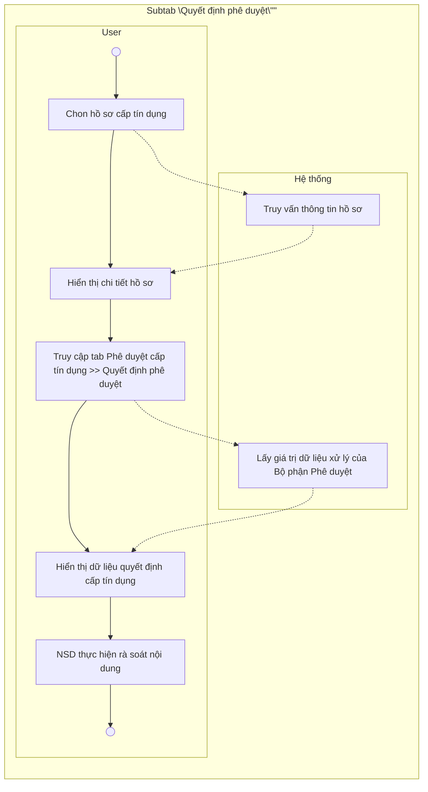

# 15.2.2. Subtab "Quyết định phê duyệt"

* <u>I. Tổng quan</u>

    * <u>1. Mục tiêu</u>

    * <u>2. Phạm vi tài liệu</u>

* <u>II. Cấu trúc hiển thị</u>

* <u>III. Luồng xử lý & Danh sách chức năng</u>

    * <u>1. Luồng xử lý tổng quát</u>

    * <u>2. Danh sách chức năng</u>

* <u>IV. Chi tiết chức năng</u>

    * <u>1.1. Mô tả:</u>

        * Description icon <u>Description</u>

        * Pre-Condition icon <u>Pre-Condition(s)</u>

        * Post-Condition icon <u>Post-Condition(s)</u>

        * <u>Business rule</u>

    * <u>1.2. Màn hình Mockup</u>

    * <u>1.3. Data các trường thông tin</u>

    * <u>1.4. Flow xử lý</u>

<table>
  <tr>
    <th>
      
US

    </th>
    <th>
      
Subtab “Quyết định phê duyệt” thuộc tab “Phê duyệt cấp tín dụng”

    </th>
  </tr>
  <tr>
    <td>
      
Squad team

    </td>
    <td>
      
Squad 2

    </td>
  </tr>
  <tr>
    <td>
      
Sprint dev

    </td>
    <td>
      
Sprint 15

    </td>
  </tr>
  <tr>
    <td>
      
Nghiệp vụ

    </td>
    <td>
    </td>
  </tr>
  <tr>
    <td>
      
Link Design

    </td>
    <td>
    </td>
  </tr>
  <tr>
    <td>
      
Developer team

    </td>
    <td>
      
BA:

      
UI/UX:

      
DEV:

      
QC:

    </td>
  </tr>
</table>

## BẢNG LỊCH SỬ THAY ĐỔI

<table>
  <tr>
    <th>
    </th>
    <th>
      
<b>Ngày</b>

    </th>
    <th>
      
<b>Mô tả</b>

    </th>
    <th>
      
<b>Người thực hiện</b>

    </th>
    <th>
      
<b>Ghi chú</b>

    </th>
  </tr>
</table>

<table>
  <tr>
    <th>
      
1

    </th>
    <th>
      
23/05/2026

    </th>
    <th>
      
Tạo mới

    </th>
    <th>
      
HangNTT86

    </th>
    <th>
      
Tạo mới tài liệu

    </th>
  </tr>
</table>

# I. Tổng quan

## 1. Mục tiêu

* Subtab **“Quyết định phê duyệt”** thuộc tab **“Phê duyệt cấp tín dụng”** cho phép cấp có thẩm quyền phê duyệt rà soát lại toàn bộ nội dung quyết định cấp tín dụng trước khi thực hiện thao tác phê duyệt/thông qua hồ sơ.

* Subtab này là cơ sở để:

    - Hiển thị preview nội dung quyết định cấp tín dụng theo dữ liệu latest đã được cấp phê duyệt thống nhất tại subtab “Thông tin Đề xuất và Thẩm định”;

    - Hỗ trợ cấp phê duyệt rà soát nhanh toàn bộ nội dung quyết định trước khi ký duyệt hồ sơ;

    - Tổng hợp tập trung các nội dung phê duyệt cuối cùng của hồ sơ cấp tín dụng;

    - Phục vụ sinh dữ liệu quyết định cấp tín dụng phục vụ các bước xử lý tiếp theo của quy trình.

* Dữ liệu hiển thị tại subtab này được hệ thống tự động theo dữ liệu latest đã được cấp phê duyệt cập nhật tại subtab “Thông tin Đề xuất và Thẩm định”.

## 2. Phạm vi tài liệu

* Tài liệu này mô tả các nguyên tắc nghiệp vụ của Subtab **“Quyết định phê duyệt”** thuộc tab “Phê duyệt cấp tín dụng”, áp dụng chung cho các nhóm luồng:

    - Nhóm 1 – Luồng phê duyệt cá nhân;

    - Nhóm 2 – Luồng Hội đồng thông thường;

    - Nhóm 3 – Luồng HĐQT thông qua.

* Subtab này kế thừa và tuân thủ các nguyên tắc chung đã được quy định tại **RSD Master – Khối Ý kiến Bộ phận Phê duyệt**: <u>/wiki/spaces/ps0142025/pages/2151809327</u>

# II. Cấu trúc hiển thị

* Subtab “Quyết định phê duyệt” hỗ trợ NSD rà soát lại toàn bộ nội dung quyết định cấp tín dụng trước khi thực hiện thao tác phê duyệt/thông qua hồ sơ.

* Dữ liệu tại subtab là dữ liệu quyết định cuối cùng của cấp phê duyệt, được hệ thống tự động tổng hợp theo phương án xử lý latest tại subtab “Thông tin Đề xuất và Thẩm định”.

* Subtab chỉ hỗ trợ chế độ xem (readonly), không cho phép NSD chỉnh sửa trực tiếp dữ liệu trên màn hình.

    * Bao gồm các nhóm thông tin:

        o Thông tin khách hàng;

        o Tài liệu liên quan;

        o Khoản cấp tín dụng;

        o Biện pháp bảo đảm;

        o Điều kiện tín dụng.

<table>
  <thead>
    <tr>
        <th colspan="2">Nhóm thông tin</th>
        <th>Mô tả</th>
    </tr>
  </thead>
  <tbody>
    <tr>
        <td>1</td>
        <td>Thông tin khách hàng</td>
        <td>Hiển thị thông tin tổng quan của khách hàng phục vụ cấp phê duyệt rà soát nhanh hồ sơ, bao gồm: Loại hình khách hàng, Ngành nghề kinh doanh, Địa chỉ, Nhóm nợ hiện tại,...</td>
    </tr>
    <tr>
        <td>2</td>
        <td>Khoản cấp tín dụng</td>
        <td>Hiển thị nội dung quyết định cuối cùng đối với các chỉ tiêu khoản cấp tín dụng như: Số tiền cấp tín dụng, Thời hạn cấp tín dụng, Mục đích cấp tín dụng, Thời hạn rút vốn, Thời gian ân hạn, Vốn chủ sở hữu tham gia, Vốn vay tham gia,...</td>
    </tr>
    <tr>
        <td>3</td>
        <td>Biện pháp bảo đảm</td>
        <td>Hiển thị nội dung quyết định cuối cùng đối với nội dung Tỷ lệ bảo đảm.</td>
    </tr>
    <tr>
        <td>4</td>
        <td>Điều kiện tín dụng</td>
        <td>Hiển thị danh sách điều kiện tín dụng cuối cùng của hồ sơ theo từng nhóm điều kiện nghiệp vụ, bao gồm: Điều kiện cấp tín dụng, Biện pháp bảo đảm, Nội dung cấp tín dụng.</td>
    </tr>
  </tbody>
</table>

# III. Luồng xử lý & Danh sách chức năng

## 1. Luồng xử lý tổng quát

## 2.Danh sách chức năng

<table>
  <thead>
    <tr>
        <th> </th>
        <th>Use Case</th>
        <th>Mô tả</th>
    </tr>
  </thead>
  <tbody>
    <tr>
        <td>1</td>
        <td>Xem thông tin quyết định phê duyệt</td>
        <td>* Cho phép NSD được phân quyền truy cập hồ sơ xem tổng hợp nội dung quyết định cấp tín dụng cuối cùng của hồ sơ. * Tại các bước thuộc Bộ phận Phê duyệt, subtab hỗ trợ NSD rà soát lại toàn bộ nội dung quyết định cấp tín dụng trước khi thực hiện thao tác phê duyệt/thông qua hồ sơ. * Sau khi hồ sơ đã phê duyệt, subtab được phân quyền cho BPĐX và các NSD có quyền xem hồ sơ để tra cứu nội dung quyết định cấp tín dụng đã được phê duyệt.</td>
    </tr>
  </tbody>
</table>

# IV. Chi tiết chức năng

* Click here to expand...

**1.1. Mô tả:**

## Column 1

## Column 2

* <strong>Subtab "Quyết định phê duyệt"</strong> là màn hình tổng hợp dữ liệu quyết định cấp tín dụng cuối cùng của hồ sơ phục vụ cấp có thẩm quyền rà soát trước khi thực hiện thao tác phê duyệt/thông qua hồ sơ.

* Hệ thống tự động kế thừa và tổng hợp dữ liệu từ subtab "Thông tin Đề xuất và Thẩm định" theo phương án xử lý latest của cấp phê duyệt để hiển thị thành nội dung quyết định cuối cùng của hồ sơ cấp tín dụng.

* Tại subtab này, hệ thống hiển thị dữ liệu readonly đối với các nhóm nghiên vụ:

<table>
  <tr>
    <th>
      <ul>
        <li><b>Subtab “Quyết định phê duyệt” hỗ trợ NSD rà soát lại toàn bộ nội dung quyết định cấp tín dụng trước khi thực hiện thao tác phê duyệt/thông qua hồ sơ.</b></li>
        <li><b>Dữ liệu tại subtab là dữ liệu quyết định cuối cùng của cấp phê duyệt, được hệ thống tự động tổng hợp theo phương án xử lý latest tại subtab “Thông tin Đề xuất và Thẩm định”.</b></li>
        <li><b>Subtab chỉ hỗ trợ chế độ xem (readonly), không cho phép NSD chỉnh sửa trực tiếp dữ liệu trên màn hình.</b></li>
        <li><b>Bao gồm các nhóm thông tin:</b></li>
        <ul>
          <li><b>Thông tin khách hàng;</b></li>
          <li><b>Tài liệu liên quan;</b></li>
          <li><b>Khoản cấp tín dụng;</b></li>
          <li><b>Biện pháp bảo đảm;</b></li>
          <li><b>Điều kiện tín dụng.</b></li>
        </ul>
      </ul>
    </th>
  </tr>
</table>

Hồ sơ thỏa mãn các điều kiện sau:

* NSD đăng nhập thành công vào hệ thống Lending Hub;
* NSD truy cập tab “Phê duyệt cấp tín dụng” → subtab “Quyết định phê

<table>
  <tr>
    <th>
    </th>
    <th>
      
<b>Nhóm thông tin</b>

    </th>
    <th>
      
<b>Mô tả</b>

    </th>
  </tr>
  <tr>
    <td>
      
1

    </td>
    <td>
      
Thông tin khách hàng

    </td>
    <td>
      
Hiển thị thông tin tổng quan của khách hàng phục vụ cấp phê duyệt rà soát nhanh hồ sơ, bao gồm: Loại hình khách hàng, Ngành nghề kinh doanh, Địa chỉ, Nhóm nợ hiện tại,...

    </td>
  </tr>
</table>

# 1.Nguyên tắc load dữ liệu quyết định phê duyệt

Business rule

* Ảnh chụp phê duyệt/phê duyệt điều chỉnh được tạo;

* Bộ hồ sơ phê duyệt/phê duyệt điều chỉnh được tạo;

* Bộ dữ liệu phê duyệt/phê duyệt điều chỉnh) được đóng băng;

* Dữ liệu version BPPD hệ thống tự động tổng hợp theo phương án xử lý latest tại subtab "Thông tin Đề xuất và Thẩm định".

- Trường hợp cấp phê duyệt lựa chọn "Thống nhất BPĐX": dữ liệu của BPPD được cập nhật theo version latest của BPĐX;

- Trường hợp cấp phê duyệt lựa chọn "Thống nhất BPTĐRR": dữ liệu của BPPD được cập nhật theo version latest của BPTĐ

- Trường hợp cấp phê duyệt trực tiếp nhập "Ý kiến khác": dữ liệu của BPPD được cập nhật theo dữ liệu BPPD nhập vào.

<table>
  <tr>
    <th>
      
2

    </th>
    <th>
      
Khoản cấp tín dụng

    </th>
    <th>
      
Hiển thị nội dung quyết định cuối cùng đối với các chỉ tiêu khoản cấp tín dụng như: Số tiền cấp tín dụng, Thời hạn cấp tín dụng, Mục đích cấp tín dụng, Thời hạn rút vốn, Thời gian ân hạn, Vốn chủ sở hữu tham gia, Vốn vay tham gia,...

    </th>
  </tr>
  <tr>
    <td>
      
3

    </td>
    <td>
      
Biện pháp bảo đảm

    </td>
    <td>
      
Hiển thị nội dung quyết định cuối cùng đối với nội dung Tỷ lệ bảo đảm.

    </td>
  </tr>
  <tr>
    <td>
      
4

    </td>
    <td>
      
Điều kiện tín dụng

    </td>
    <td>
      
Hiển thị danh sách điều kiện tín dụng cuối cùng của hồ sơ theo từng nhóm điều kiện nghiệp vụ, bao gồm: Điều kiện cấp tín dụng, Biện pháp bảo đảm, Nội dung cấp tín dụng.

    </td>
  </tr>
</table>

Subtab "Quyết định phê duyệt" chỉ hỗ trợ chế độ xem (readonly):

* Không cho phép NSD nhập/chỉnh sửa dữ liệu;

* Không hiển thị trạng thái cảnh báo khác biệt;

* Không hiển thị lựa chọn phương án xử lý;

* Không hiển thị popup nhập liệu ý kiến phê duyệt.

Mọi chỉnh sửa phải thực hiện tại tab "Thông tin Đề xuất và Phê duyệt".

Trường hợp hồ sơ được trình lại Bộ phận Phê duyệt:

* Hệ thống load lại dữ liệu latest của subtab "Thông tin Đề xuất và Thẩm định";

* Hệ thống cập nhật lại toàn bộ dữ liệu hiển thị tại subtab "Quyết định phê duyệt" theo phương án xử lý latest của cấp phê duyệt.

Non-Function

Đảm bảo phân quyền theo vai trò NSD, loại hồ sơ tài liệu, trạng thái hồ sơ tín dụng và phạm vi hồ sơ được cấp quyền truy cập/thao tác.

Đảm bảo khả năng truy vết và kiểm soát nghiệp vụ.

# Column 2

* Bộ dữ liệu quyết định phê duyệt được lưu;

Thời gian phản hồi tuân thủ SLA chung của hệ thống Lending Hub.

## 1.2. Màn hình Mockup

Link Figma: <u>https://www.figma.com/design/PXt1aa5gAeWjyYKmiwN7i5/-W--Squad-2--Lu%E1%BB%93ng-ph%C3%AA-duy%E1%BB%87t?node-id=11007-111945&t=UFJbyuTtNeOgM0tx-4</u>

Figma logo

<table>
    <tr>
        <th>Case</th>
        <th>Màn hình mockup</th>
    </tr>
    <tr>
        <td>Luồng cấp mới/tái cấp</td>
        <td>Screenshot of a software interface showing a credit approval decision document with various sections including general information, credit limit details, and approval history.</td>
    </tr>
</table>

<table>
  <tr>
    <th>
      
4

    </th>
    <th>
      
Điều kiện tín dụng

    </th>
    <th>
      
Hiển thị danh sách điều kiện tín dụng cuối cùng của hồ sơ theo từng nhóm điều kiện nghiệp vụ, bao gồm: Điều kiện cấp tín dụng, Biện pháp bảo đảm, Nội dung cấp tín dụng.

    </th>
  </tr>
</table>

## 1.3. Data các trường thông tin

<table>
  <thead>
    <tr>
        <th>STT</th>
        <th>Hạng mục</th>
        <th>Định dạng</th>
        <th>Kiểu thao tác</th>
        <th>Bắt buộc (M/O)</th>
        <th>Độ dài</th>
        <th>Giá trị mặc định</th>
        <th>Mô tả / Validate</th>
    </tr>
  </thead>
  <tbody>
    <tr>
        <td>1</td>
        <td>Nhóm “Thông tin khách hàng”</td>
        <td>Text</td>
        <td>Hiển thị</td>
        <td>-</td>
        <td>-</td>
        <td>-</td>
        <td>* Hiển thị thông tin tổng quan khách hàng phục vụ cấp phê duyệt rà soát nội dung quyết định cấp tín dụng. * Các trường thông tin và cách thức lấy dữ liệu tương tự như mô tả tại</td>
    </tr>
    <tr>
        <td>2</td>
        <td>Nhóm “Khoản cấp tín dụng”</td>
        <td>Text</td>
        <td>Hiển thị</td>
        <td>-</td>
        <td>-</td>
        <td>-</td>
        <td>* Danh sách chỉ tiêu tương tự nhóm “Khoản cấp tín dụng” tại subtab “Thông tin Đề xuất và Thẩm định”, chi tiết tại https://docs.google.com/spreadsheets/d/1Dd4RWvM7jvr_gN6u33kKkr470OmY1i5T/edit?pli=1&amp;gid=1616535324#gid=1616535324 * Chỉ hiển thị dữ liệu theo version latest BPPD, không hiển thị ý kiến BPĐX và BPTĐ * Trường hợp luồng điều chỉnh, bổ sung cột Nội dung trước điều chỉnh, dữ liệu lấy theo lần duyệt gần nhất (trước HSTD đang trình)</td>
    </tr>
    <tr>
        <td>3</td>
        <td>Nhóm “Biện pháp bảo đảm”</td>
        <td>Text</td>
        <td>Hiển thị</td>
        <td>-</td>
        <td>-</td>
        <td>-</td>
        <td>* Danh sách chỉ tiêu tương tự nhóm “Biện pháp bảo đảm” tại subtab “Thông tin Đề xuất và Thẩm định”, chi tiết tại https://docs.google.com/spreadsheets/d/1Dd4RWvM7jvr_gN6u33kKkr470OmY1i5T/edit?pli=1&amp;gid=1616535324#gid=1616535324 * Chỉ hiển thị dữ liệu theo version latest BPPD, không hiển thị ý kiến BPĐX và BPTĐ * Trường hợp luồng điều chỉnh, bổ sung cột Nội dung trước điều chỉnh, dữ liệu lấy theo lần duyệt gần nhất (trước HSTD đang trình)</td>
    </tr>
  </tbody>
</table>

<table>
  <tr>
    <th>
    </th>
    <th>
      
<b>Use Case</b>

    </th>
    <th>
      
<b>Mô tả</b>

    </th>
  </tr>
</table>

## 1.4. Flow xử lý

<table>
  <thead>
    <tr>
        <th>Tính năng/Step</th>
        <th>Action</th>
        <th>Actor</th>
        <th>Mô tả chi tiết xử lý</th>
    </tr>
  </thead>
  <tbody>
    <tr>
        <td colspan="4">Kích hoạt màn hình</td>
    </tr>
    <tr>
        <td>Step 1</td>
        <td>* NSD đăng nhập thành công vào hệ thống Lending Hub. * NSD truy cập tab “Phê duyệt cấp tín dụng” → subtab “Quyết định phê duyệt”.</td>
        <td>NSD</td>
        <td>* Hệ thống xác định quyền truy cập subtab theo bước xử lý hiện tại và phân quyền của NSD.</td>
    </tr>
    <tr>
        <td colspan="4">Hiển thị dữ liệu quyết định phê duyệt</td>
    </tr>
    <tr>
        <td>Step 2</td>
        <td>Hệ thống hiển thị dữ liệu tại subtab “Quyết định phê duyệt”.</td>
        <td>Hệ thống</td>
        <td>* Hệ thống load dữ liệu quyết định cấp tín dụng từ theo version latest của BPPD (được cập nhật theo kết quả xử lý tại subtab “Thông tin Đề xuất và Thẩm định”) * Dữ liệu hiển thị readonly tại các nhóm thông tin.</td>
    </tr>
    <tr>
        <td colspan="4">Rà soát nội dung quyết định</td>
    </tr>
    <tr>
        <td>Step 3</td>
        <td>NSD rà soát nội dung quyết định cấp tín dụng.</td>
        <td>NSD</td>
        <td>* NSD thực hiện rà soát nội dung quyết định cấp tín dụng trước khi thực hiện thao tác phê duyệt/thông qua hồ sơ. * Không cho phép chỉnh sửa trực tiếp dữ liệu tại subtab này.</td>
    </tr>
  </tbody>
</table>