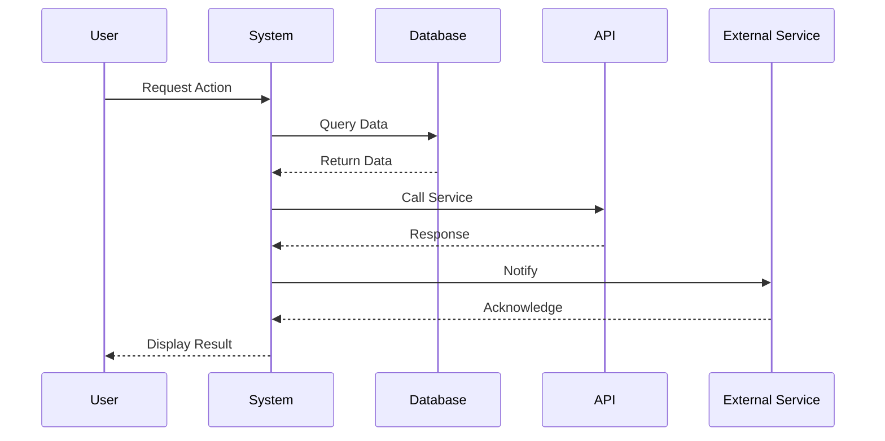

# Tích hợp Esign

# 1.Tổng quan

* **Mục tiêu:** Trong luồng **trình cấp tín dụng trên LDH**, khi hồ sơ được xử lý đến **cấp phê duyệt cuối cùng**, hệ thống cần hỗ trợ người dùng Ký số văn bản để hoàn tất quá trình phê duyệt

* **Thành phần tham gia**

    * **Người dùng:** Cán bộ BIDV thao tác trên **LDH**, có thẩm quyền xử lý bước cuối trong luồng trình cấp tín dụng

    * **Hệ thống:**

        * **LDH:** hệ thống xử lý hồ sơ tín dụng, điều phối hành vi người dùng, sinh chứng từ và lưu ECM

        * **ESign:** dịch vụ trung gian thực hiện tích hợp ký số

        * **CA Provider:** đơn vị cung cấp dịch vụ ký số từ xa

        * **CA Mobile App:** ứng dụng để người dùng xác nhận ký

* **Tài liệu tham chiếu:** <u>Các Use case Ký số</u>

# 2.Luồng xử lý

## 2.1. Flow

## 2.2.Mô tả

<table>
  <tr>
    <th>
    </th>
    <th>
      
<b>Step</b>

    </th>
    <th>
      
<b>Actor</b>

    </th>
    <th>
      
<b>Mô tả chi tiết</b>

    </th>
  </tr>
</table>

# <strong>Step1- Người dùng tại bước cuối</strong>

<table>
  <tr>
    <th>
      
1

    </th>
    <th>
      
Step1- Người dùng tại bước cuối cùng thực hiện Phê duyệt/ Từ chối

    </th>
    <th>
      
NSD

    </th>
    <th>
      <ol>
        <li>Người dùng hoàn tất kiểm tra hồ sơ trên LDH</li>
        <li>Thực hiện thao tácPhê duyệt/Từ chối</li>
        <li>Hệ thống LDH hiển thị màn hình popup Xác nhận phê duyệt/Từ chối kèm theo file mẫu biểu đã sinh</li>
        <li>Người dùng chọn Ký số trên màn hình popup</li>
        <li>Chuyển tiếpStep2</li>
      </ol>
    </th>
  </tr>
  <tr>
    <td>
      
2

    </td>
    <td>
      
Step2- Khởi tạo giao dịch ký số

    </td>
    <td>
      
LDH

    </td>
    <td>
      <ol>
        <li>LDH gọi ESign để tạo một giao dịch ký số cho user</li>
      </ol>
      
POST /external/v1/employee/signature/tx/init

      <ol>
        <li>ESign trả về thông tin phiên ký gồm mã giao dịch và thông tin chứng thư số</li>
        <li>Chuyển tiếpStep3</li>
      </ol>
    </td>
  </tr>
  <tr>
    <td>
      
3

    </td>
    <td>
      
Step3 - LDH kiểm tra thông tin và chuẩn bị dữ liệu ký

    </td>
    <td>
      
LDH

    </td>
    <td>
      
Căn cứ trên thông tin ESign trả về. LDH thực hiện

      <ol>
        <li>Nếu ESign trả về không có chứng thư số</li>
        <ol>
          <li>LDH hiển thị thông báo lỗi cho người dùng “Anh/chị chưa được cấp tài khoản ký số. Vui lòng kiểm tra lại”</li>
          <li>Và thực hiện kết thúc luồng không cho NSD phê duyêt/từ chối hồ sơ</li>
        </ol>
        <li>Nếu ESign trả về có chứng thư số</li>
        <ol>
          <li>LDH chuẩn bị file cần ký, thêm ảnh, text hiển thị vùng ký</li>
          <li>Sinh hash của file</li>
          <li>Chuyển tiếp Step4</li>
        </ol>
      </ol>
    </td>
  </tr>
  <tr>
    <td>
      
4

    </td>
    <td>
      
Step4 - LDH gửi yêu cầu ký số qua ESign

    </td>
    <td>
      
LDH

    </td>
    <td>
      <ol>
        <li>LDH gửi hash của chứng từ sang ESign</li>
      </ol>
      
POST /external/v1/employee/signature/tx/sign_hashs

      <ol>
        <li>ESign chuyển tiếp yêu cầu sang CA để tạo yêu cầu ký</li>
      </ol>
    </td>
  </tr>
  <tr>
    <td>
      
5

    </td>
    <td>
      
Step5.1 - Người dùng không xác nhận ký trên CA Mobile App

    </td>
    <td>
      
CA

    </td>
    <td>
      <ol>
        <li>Sau 5 phút nếu không nhận confirm từ NSD</li>
        <li>ESign trả status = TIMEOUT / EXPIRED</li>
        <li>LDH nhận kết quả qua polling</li>
        <li>LDH ghi nhận giao dịch thất bại và hiển thị thông báo"Quá thời gian xác nhận ký số"→ Cho phép NSD thực hiện lại ký số hoặc thoát và quay lại hồ sơ</li>
      </ol>
    </td>
  </tr>
</table>

# Column 2

# 1. Người dùng hoàn tất kiểm tra hồ sơ trên LDH2. Thực hiện thao tác <strong>Phê duyệt/Từ chối</strong>3. Hệ thống LDH hiển thị màn hình popup Xác nhận phê duyệt/Từ chối kèm theo

# Step5.1 - Người dùng không

<table>
  <tr>
    <th>
      
5

    </th>
    <th>
      
Step5.1 - Người dùng không xác nhận ký trên CA Mobile App

    </th>
    <th>
      
CA

    </th>
    <th>
      <ol>
        <li>Sau 5 phút nếu không nhận confirm từ NSD</li>
        <li>ESign trả status = TIMEOUT / EXPIRED</li>
        <li>LDH nhận kết quả qua polling</li>
        <li>LDH ghi nhận giao dịch thất bại và hiển thị thông báo"Quá thời gian xác nhận ký số"→ Cho phép NSD thực hiện lại ký số hoặc thoát và quay lại hồ sơ</li>
      </ol>
    </th>
  </tr>
  <tr>
    <td>
      
6

    </td>
    <td>
      
Step5.2 - Người dùng xác nhận ký trên CA Mobile App

    </td>
    <td>
      
Người dùng

    </td>
    <td>
      <ol>
        <li>CA gửi thông báo/yêu cầu ký đến ứng dụng CA Mobile App</li>
        <li>Người dùng mở ứng dụng CA</li>
        <li>Kiểm tra thông tin yêu cầu ký</li>
        <li>Thực hiện xác thực và nhấnXác nhận ký → Chuyển tiếp Step6</li>
      </ol>
    </td>
  </tr>
  <tr>
    <td>
      
7

    </td>
    <td>
      
Step6 - CA thực hiện ký và trả kết quả

    </td>
    <td>
      
CA

    </td>
    <td>
      <ol>
        <li>Sau khi người dùng xác nhận, CA dùng private key của người ký để ký số</li>
        <li>CA trả trạng thái đồng ý ký</li>
        <li>Kết quả ký được trả về ESign theo một trong hai cách:</li>
        <ul>
          <li>Webhook: CA chủ động push kết quả</li>
        </ul>
      </ol>
      
POST /external/v1/employee/signature/tx/webhook/${ca_code}/result

      <ol>
        <ul>
          <li>Polling: LDH/ESign chủ động hỏi trạng thái</li>
        </ul>
      </ol>
      
GET /external/v1/employee/signature/tx/sign_hashs/results

    </td>
  </tr>
  <tr>
    <td>
      
8

    </td>
    <td>
      
Step7- LDH nhận lại chứng từ đã ký

    </td>
    <td>
      
LDH

    </td>
    <td>
      <ol>
        <li>ESign trả kết quả ký cho LDH bao gồm Xác nhận/Từ chối</li>
        <li>Với trường hợp từ chối ký số:</li>
        <ol>
          <li>LDH nhận trạng thái = Từ chối</li>
          <li>Hiển thị thông báo"Bạn đã từ chối ký số""</li>
          <li>Cho phép NSD thực hiện lại ký số hoặc thoát và quay lại hồ sơ</li>
        </ol>
        <li>Với trường hợp xác nhận ký số:</li>
        <ol>
          <li>LDH nhận chữ ký số / file đã ký</li>
          <li>LDH nhúng chữ ký vào file gốc để tạo chứng từ hoàn chỉnh có giá trị pháp lý</li>
          <li>Chuyển tiếpstep8</li>
        </ol>
      </ol>
    </td>
  </tr>
  <tr>
    <td>
      
9

    </td>
    <td>
      
Step8 - LDH hoàn tất xử lý

    </td>
    <td>
      
LDH

    </td>
    <td>
      <ol>
        <li>LDH cập nhật trạng thái xử lý ký số thành công</li>
        <li>Hiển thị thông báo cho người dùng</li>
        <li>Hồ sơ kết thúc theo nhánhphê duyệt cuối cùng</li>
      </ol>
    </td>
  </tr>
</table>

# Column 2

# 1. Sau 5 phút nếu không nhận confirm từ NSD2. ESign trả status = TIMEOUT / EXPIRED3. LDH nhận kết quả qua polling

# <strong>Step8 - LDH</strong>

<table>
  <tr>
    <th>
      
9

    </th>
    <th>
      
Step8 - LDH hoàn tất xử lý

    </th>
    <th>
      
LDH

    </th>
    <th>
      <ol>
        <li>LDH cập nhật trạng thái xử lý ký số thành công</li>
        <li>Hiển thị thông báo cho người dùng</li>
        <li>Hồ sơ kết thúc theo nhánhphê duyệt cuối cùng</li>
      </ol>
    </th>
  </tr>
</table>

# Column 2

# 1. LDH cập nhật trạng thái xử lý ký số thành công2. Hiển thị thông báo cho người dùng